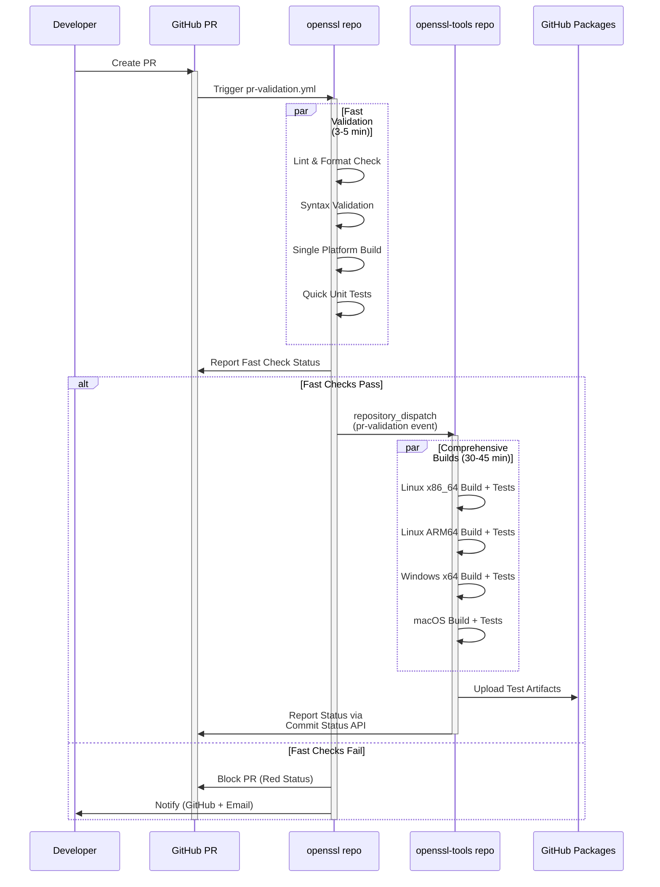
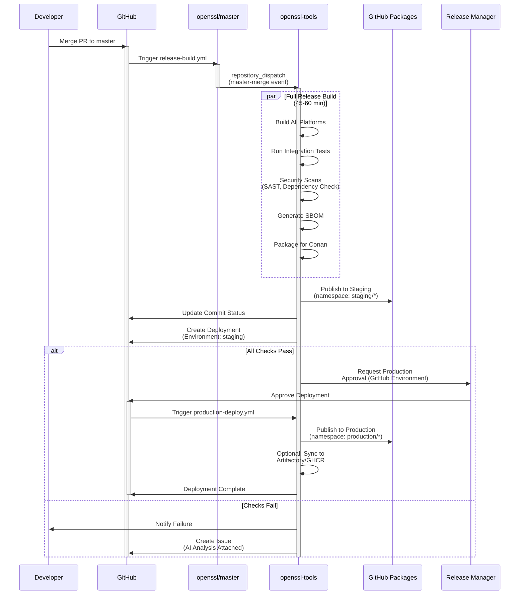
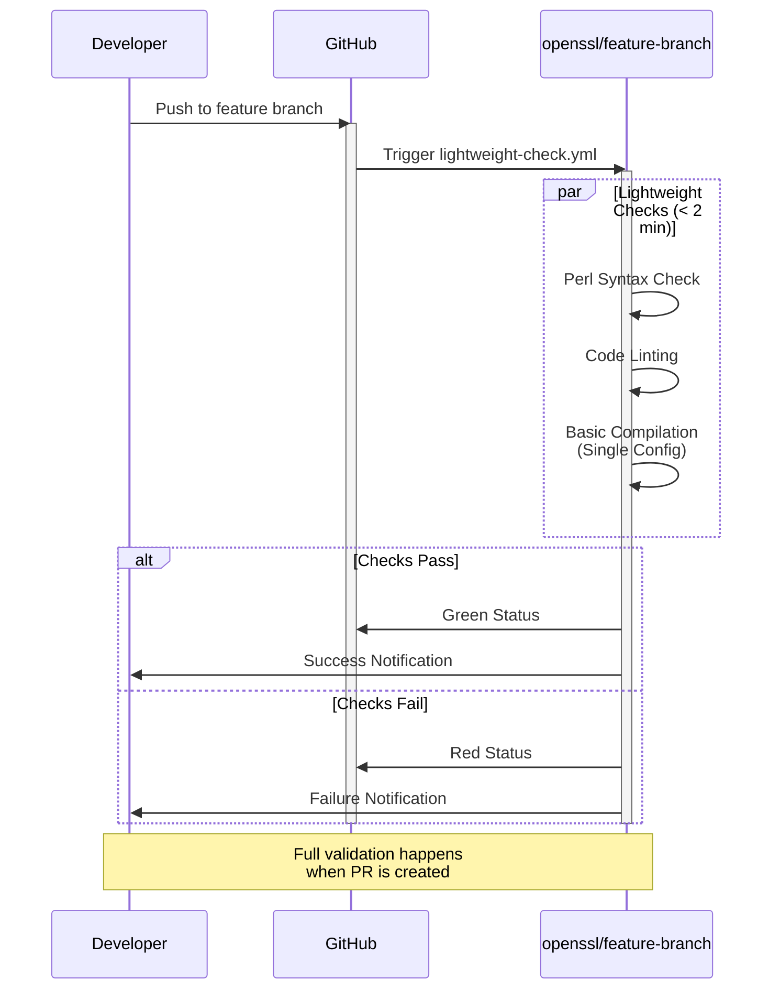
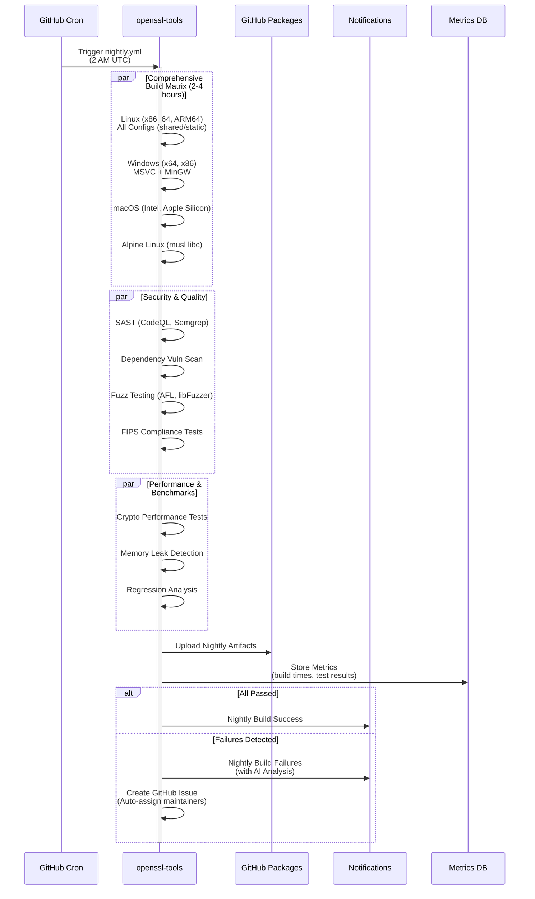

# OpenSSL Two-Repository CI/CD Implementation Plan

## Executive Summary

Implement modern CI/CD pipeline for OpenSSL with two-repository architecture:
- **sparesparrow/openssl**: Source code + basic validation
- **sparesparrow/openssl-tools**: Comprehensive CI/CD orchestration

**Strategy**: Hybrid approach balancing speed, cost-efficiency, and production safety.

## Design Decisions (Based on Analysis)

### 1. PR Created in openssl → **Option C (Hybrid)**
- Fast validation in openssl repo (3-5 min)
- Trigger comprehensive builds in openssl-tools via `repository_dispatch`
- Parallel execution for quick feedback + thorough validation

### 2. PR Merged to Master → **Option C (Build + Manual Approval)**
- Automated full build + testing in openssl-tools
- Auto-publish to staging (GitHub Packages staging namespace)
- Manual approval gate for production release

### 3. Commit to Non-Master Branch → **Option B (Lightweight)**
- Syntax validation, linting, quick tests only
- Optimize CI minutes, full validation at PR stage

### 4. Nightly Builds → **Option D (Comprehensive)**
- Full platform matrix (Linux x86/ARM, Windows, macOS)
- Security scans, performance benchmarks, dependency updates
- Runs at 2 AM UTC (off-peak)

### 5. Cross-Repo Communication → **Option A (repository_dispatch + Status API)**
- openssl triggers openssl-tools via `repository_dispatch`
- openssl-tools reports back via GitHub Commit Status API
- Clean separation of concerns

### 6. Artifact Publishing → **Option C (Two-Tier)**
- Master commits → GitHub Packages staging namespace
- Tagged releases → GitHub Packages production + optional Artifactory/GHCR
- Primary: GitHub Packages, fallback: JFrog Artifactory / GHCR Docker

### 7. Test Strategy → **Option A (Pyramidal)**
- PR: Fast unit tests (~5-8 min)
- Master: Unit + integration tests (~20-25 min)
- Nightly: Comprehensive suite including fuzz tests (~2-4 hours)

### 8. Failure Handling → **Option D (AI Agent + Manual)**
- Block PR merge on failure
- AI agent (from PR #17) analyzes logs, suggests fixes
- Manual review for complex failures
- GitHub Issues auto-created with AI analysis

## Workflow Diagrams (Mermaid)

### Diagram 1: PR Created in openssl



### Diagram 2: PR Merged to Master in openssl



### Diagram 3: Commit to Non-Master Branch in openssl



### Diagram 4: Nightly Build on Master



## Implementation Phases

### Phase 1: Foundation (PR #14 Merge + Basic Setup)
**Duration**: 1-2 days

1. **Merge PR #14** (CI/CD Templates)
2. **Move AI/Agent content** from PR #14 to PR #17
3. **Combine PR #15 + #16** into single PR
4. **Setup in openssl repo**:
   - Create `.github/workflows/pr-validation.yml`
   - Create `.github/workflows/lightweight-check.yml`
   - Create `.github/workflows/trigger-tools.yml`
5. **Setup in openssl-tools repo**:
   - Create `.github/workflows/pr-build.yml`
   - Create `.github/workflows/release-build.yml`
   - Create `.github/workflows/nightly.yml`
6. **Configure GitHub Secrets**:
   - `DISPATCH_TOKEN`: For cross-repo triggers
   - `PACKAGES_TOKEN`: For GitHub Packages publishing

### Phase 2: Cross-Repo Integration (repository_dispatch)
**Duration**: 2-3 days

1. **Implement triggering mechanism** in openssl workflows
2. **Implement status reporting** in openssl-tools workflows
3. **Setup GitHub Packages** repositories:
   - `staging/openssl`: For master commits
   - `production/openssl`: For tagged releases
4. **Test cross-repo communication**

### Phase 3: Artifact Management
**Duration**: 2-3 days

1. **Conan package configuration** for GitHub Packages
2. **Staging/Production separation** logic
3. **Environment protection rules** (manual approval gates)
4. **Optional**: Artifactory/GHCR fallback setup

### Phase 4: Comprehensive Testing & Nightly
**Duration**: 3-4 days

1. **Implement pyramidal test strategy**
2. **Setup nightly workflow** with full matrix
3. **Performance benchmarking** integration
4. **Security scanning** integration (CodeQL, Semgrep)

### Phase 5: AI Agent Integration (from PR #17)
**Duration**: 2-3 days

1. **Failure analysis agent** setup
2. **Auto-issue creation** with AI insights
3. **Fix suggestion** system
4. **Human review workflow**

### Phase 6: Testing & Documentation
**Duration**: 2-3 days

1. **Create test PR** in openssl repo
2. **Verify all workflows trigger correctly**
3. **Update README.md** with workflow diagrams (embed Mermaid)
4. **Cleanup temporary scripts**

## Success Criteria

- [ ] PR creation triggers fast validation + comprehensive builds
- [ ] Master merge triggers release pipeline with staging publish
- [ ] Branch commits run lightweight checks only
- [ ] Nightly builds run full matrix at 2 AM UTC
- [ ] Cross-repo communication works via repository_dispatch + Status API
- [ ] Artifacts published to GitHub Packages (staging/production)
- [ ] Manual approval gate works for production releases
- [ ] Test PR successfully exercises all workflows
- [ ] Documentation updated (README only, no new files)
- [ ] Temporary scripts cleaned up

## Repository Structure

```
sparesparrow/openssl/
├── .github/
│   └── workflows/
│       ├── pr-validation.yml          # Fast checks on PR
│       ├── lightweight-check.yml      # Branch push checks
│       ├── trigger-tools.yml          # Cross-repo trigger
│       └── basic-validation.yml       # Existing workflow (keep minimal)
├── conanfile.py                       # Minimal, delegates to tools repo
└── README.md                          # Updated with workflow diagrams

sparesparrow/openssl-tools/
├── .github/
│   └── workflows/
│       ├── pr-build.yml               # Comprehensive PR builds
│       ├── release-build.yml          # Master merge → staging
│       ├── production-deploy.yml      # Staging → production (manual)
│       ├── nightly.yml                # Full matrix + security/perf
│       └── on-demand-build.yml        # Manual trigger for testing
├── conanfile.py                       # Full build orchestration logic
├── scripts/
│   ├── publish-to-github-packages.py  # Conan → GitHub Packages
│   ├── trigger-status-update.py       # Update commit status in openssl
│   └── ai-failure-analysis.py         # AI agent integration
└── README.md                          # Updated with architecture info
```

## Cost & Performance Estimates

### GitHub Actions Minutes (Free Tier: 2000 min/month)

**Per PR** (~15 PRs/month):
- Fast validation: 5 min × 15 = 75 min
- Comprehensive builds: 45 min × 15 = 675 min
- **Total PR**: 750 min/month

**Per Master Commit** (~10 commits/month):
- Release builds: 60 min × 10 = 600 min

**Nightly Builds** (30 days/month):
- Nightly: 120 min × 30 = 3600 min → **Exceeds free tier!**

**Optimization Strategy**:
- Run nightly only 3x/week (Mon/Wed/Fri): 120 × 12 = 1440 min
- **Total**: 750 + 600 + 1440 = **2790 min/month**
- **Overage**: ~800 min × $0.008 = **$6.40/month**

**Alternative**: Use self-hosted runner for nightly builds (free)

### GitHub Packages Storage (Free Tier: 500 MB)

- Staging artifacts: ~50 MB per build × 10 = 500 MB
- **Within free tier** with cleanup policy (keep last 5)

## Next Steps

**Ready to proceed with implementation?**

I will:
1. Merge PR #14, move AI content to PR #17, combine #15+#16
2. Create workflow files in both repositories
3. Implement mermaid diagrams in README.md
4. Test with real PR in openssl repo
5. Cleanup temporary scripts

**Confirm to proceed with execution.**