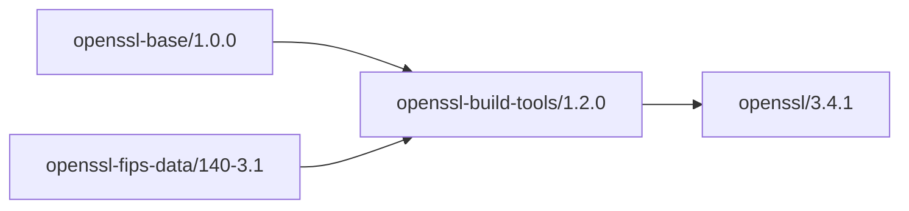

# OpenSSL Build Tools - AI Context

Role: Build orchestration layer consuming foundation packages.

Key:
- Depends on `openssl-base/1.0.0` and `openssl-fips-data/140-3.1` from Cloudsmith
- Exposes env: `OPENSSL_BUILD_TOOLS_VERSION`, `OPENSSL_TOOLS_*`
- Ships scripts and profiles only; no C/C++ build output

CI/CD:
- Workflow `.github/workflows/build-and-publish.yml`
- Uploads to Cloudsmith on pushes to `main`
- Caches Conan (`~/.conan2`) for speed

Usage:
- Configure remote: `sparesparrow-conan/openssl-conan`
- Require: `openssl-build-tools/1.2.0`

Architecture:

