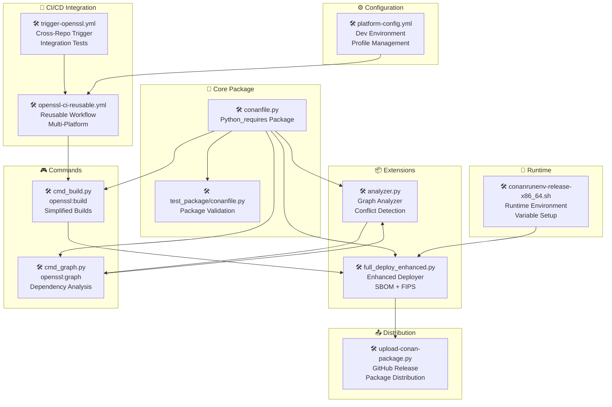

# Conan Python Environment

Cross-platform Python-based Conan development environment.

## 🚀 Quick Start

### Setup Environment
```bash
# Cross-platform setup
python scripts/setup-conan-python-env.py

# Or use the orchestrator directly
python scripts/conan/conan_cli.py setup
```

### Developer Commands
```bash
# Using Python CLI (cross-platform)
python scripts/conan/conan_cli.py install
python scripts/conan/conan_cli.py build
python scripts/conan/conan_cli.py test

```

## 🖥️ Platform Support

### Windows
- **Launchers**: `.bat` files
- **Default Profile**: `windows-msvc2022`
- **Available Profiles**: `windows-msvc2022`, `debug`

### macOS
- **Launchers**: Shell scripts
- **Default Profile**: `macos-clang14`
- **Available Profiles**: `macos-clang14`, `debug`

### Linux
- **Launchers**: Shell scripts
- **Default Profile**: `linux-gcc11`
- **Available Profiles**: `linux-gcc11`, `linux-clang15`, `debug`

## 🔧 Python Orchestrator

The `conan_orchestrator.py` provides:
- Cross-platform profile management
- Virtual environment handling
- Platform detection
- Unified command interface

## 📁 Directory Structure

```
conan-dev/
├── profiles/           # Platform-specific profiles
├── venv/              # Python virtual environment
├── cache/             # Conan cache
├── artifacts/         # Build artifacts
└── platform-config.yml # Platform configuration

scripts/conan/
├── conan_orchestrator.py  # Core orchestrator
├── conan_cli.py          # Unified CLI
├── conan-install.py      # Install script
├── conan-build.py        # Build script
├── conan-dev-setup.py    # Setup script
├── conan-install.bat     # Windows launcher
├── conan-build.bat       # Windows launcher
├── conan-dev-setup.bat   # Windows launcher
├── conan-cli.bat         # Windows launcher
├── conan-install         # Unix launcher
├── conan-build           # Unix launcher
├── conan-dev-setup       # Unix launcher
└── conan-cli             # Unix launcher
```

## 🎯 Usage Examples

### Basic Usage
```bash
# Setup (one time)
python scripts/conan/conan_cli.py setup


conan install . -->   

python scripts/conan/conan_cli.py list-profiles
python scripts/conan/conan_cli.py info
 -->   python scripts/conan/conan_cli.py download_conan
 -->   python scripts/conan/conan_cli.py bootstrap_env
 -->   python scripts/conan/conan_cli.py install_deps

conan build .   -->   python scripts/conan/conan_cli.py build


python scripts/conan/conan_cli.py build --test

```

### Platform-Specific Usage
```bash
# Windows
conan-install.bat -p windows-msvc2022
conan-build.bat -t

# macOS
./conan-install -p macos-clang14
./conan-build -t

# Linux
./conan-install -p linux-clang15
./conan-build -t
```

```

# add diagrams for each installation type in [deploy install_system_requires install_sources install_binaries install_consumer]  using typical type of download [recipe package download_full] 
```mermaid

```
