# Conan Python Environment

Cross-platform Python-based Conan development environment.

## 🚀 Quick Start

### Setup Environment
```bash
# Cross-platform setup
python scripts/setup-conan-python-env.py

# Or use the orchestrator directly
python scripts/conan/conan_cli.py setup
```

### Developer Commands
```bash
# Using Python CLI (cross-platform)
python scripts/conan/conan_cli.py install
python scripts/conan/conan_cli.py build
python scripts/conan/conan_cli.py test

```

## 🖥️ Platform Support

### Windows
- **Launchers**: `.bat` files
- **Default Profile**: `windows-msvc2022`
- **Available Profiles**: `windows-msvc2022`, `debug`

### macOS
- **Launchers**: Shell scripts
- **Default Profile**: `macos-clang14`
- **Available Profiles**: `macos-clang14`, `debug`

### Linux
- **Launchers**: Shell scripts
- **Default Profile**: `linux-gcc11`
- **Available Profiles**: `linux-gcc11`, `linux-clang15`, `debug`

## 🔧 Python Orchestrator

The `conan_orchestrator.py` provides:
- Cross-platform profile management
- Virtual environment handling
- Platform detection
- Unified command interface

## 📁 Directory Structure

```
conan-dev/
├── profiles/           # Platform-specific profiles
├── venv/              # Python virtual environment
├── cache/             # Conan cache
├── artifacts/         # Build artifacts
└── platform-config.yml # Platform configuration

scripts/conan/
├── conan_orchestrator.py  # Core orchestrator
├── conan_cli.py          # Unified CLI
├── conan-install.py      # Install script
├── conan-build.py        # Build script
├── conan-dev-setup.py    # Setup script
├── conan-install.bat     # Windows launcher
├── conan-build.bat       # Windows launcher
├── conan-dev-setup.bat   # Windows launcher
├── conan-cli.bat         # Windows launcher
├── conan-install         # Unix launcher
├── conan-build           # Unix launcher
├── conan-dev-setup       # Unix launcher
└── conan-cli             # Unix launcher
```

## 🎯 Usage Examples

### Basic Usage
```bash
# Setup (one time)
python scripts/conan/conan_cli.py setup


conan install . -->   

python scripts/conan/conan_cli.py list-profiles
python scripts/conan/conan_cli.py info
 -->   python scripts/conan/conan_cli.py download_conan
 -->   python scripts/conan/conan_cli.py bootstrap_env
 -->   python scripts/conan/conan_cli.py install_deps

conan build .   -->   python scripts/conan/conan_cli.py build


python scripts/conan/conan_cli.py build --test

```

### Platform-Specific Usage
```bash
# Windows
conan-install.bat -p windows-msvc2022
conan-build.bat -t

# macOS
./conan-install -p macos-clang14
./conan-build -t

# Linux
./conan-install -p linux-clang15
./conan-build -t
```

```

```mermaid
graph TB
    subgraph "🔧 Core Package"
        A[🛠️ conanfile.py<br/>Python_requires Package]
        B[🛠️ test_package/conanfile.py<br/>Package Validation]
    end

    subgraph "📦 Extensions"
        C[🛠️ full_deploy_enhanced.py<br/>Enhanced Deployer<br/>SBOM + FIPS]
        D[🛠️ analyzer.py<br/>Graph Analyzer<br/>Conflict Detection]
    end

    subgraph "🎮 Commands"
        E[🛠️ cmd_build.py<br/>openssl:build<br/>Simplified Builds]
        F[🛠️ cmd_graph.py<br/>openssl:graph<br/>Dependency Analysis]
    end

    subgraph "🔄 CI/CD Integration"
        G[🛠️ openssl-ci-reusable.yml<br/>Reusable Workflow<br/>Multi-Platform]
        H[🛠️ trigger-openssl.yml<br/>Cross-Repo Trigger<br/>Integration Tests]
    end

    subgraph "⚙️ Configuration"
        I[🛠️ platform-config.yml<br/>Dev Environment<br/>Profile Management]
    end

    subgraph "📤 Distribution"
        J[🛠️ upload-conan-package.py<br/>GitHub Release<br/>Package Distribution]
    end

    subgraph "🔧 Runtime"
        K[🛠️ conanrunenv-release-x86_64.sh<br/>Runtime Environment<br/>Variable Setup]
    end

    %% Core Package Relations
    A --> B
    A --> C
    A --> D
    A --> E
    A --> F

    %% Extension Relations
    C --> J
    D --> F

    %% Command Relations
    E --> C
    F --> D

    %% CI/CD Relations
    G --> E
    H --> G

    %% Configuration Relations
    I --> G

    %% Runtime Relations
    K --> C
```

# add diagrams for each installation type in [deploy install_system_requires install_sources install_binaries install_consumer]  using typical type of download [recipe package download_full] 
```mermaid

```
# Track B Verification & Hardening Plan (OMS-Enhanced)

## Overview

Verify and harden the Track B (Developer Experience & Onboarding) implementation with OMS-style patterns: runtime environment exports, CI deployers for portable artifacts, GitHub composite actions, and comprehensive metadata generation for production readiness and audit compliance.

## Verification Gates (Smoke Tests)

### 1. Conan 2.x Bootstrap Verification

**Goal**: Ensure bootstrap script is idempotent and works across platforms

**Test Steps**:

```bash
# Fresh system test (Linux/macOS/WSL)
cd /tmp
python3 ~/projects/openssl-devenv/openssl-devenv/bootstrap/openssl-conan-init.py --dev

# Verify:
- Conan 2.x installed (fixed version 2.21.0)
- Remotes configured (sparesparrow-conan, conancenter)
- Repos cloned to ~/sparesparrow/
- Extensions installed to ~/.conan2/extensions/
- Symlinks valid (check permissions)
```

**Success Criteria**:

- Script completes in <15 minutes
- Second run is idempotent (no errors)
- All repos present and up-to-date

### 2. Custom Commands Registration

**Goal**: Verify extensions work without manual intervention

**Test Steps**:

```bash
# Test command availability
conan openssl:build --help
conan openssl:graph --help

# Test in clean project
mkdir /tmp/test-conan && cd /tmp/test-conan
echo "[requires]
openssl/3.3.2" > conanfile.txt

conan openssl:graph --json
```

**Success Criteria**:

- Commands appear in `conan --help`
- Work without additional pip installs
- Graph analyzer provides structured output

### 3. Deployer Functionality

**Goal**: Verify full_deploy_enhanced creates proper artifacts

**Test Steps**:

```bash
# Test deployer
conan install . --deployer=full_deploy_enhanced --deployer-folder=./deploy

# Verify structure:
ls deploy/full_deploy/       # Binaries/libraries/headers
ls deploy/sbom.json          # SBOM generated
ls deploy/fips/              # FIPS artifacts (if enabled)
```

**Success Criteria**:

- Deploy folder is in conan cache and $OPENSSL_DEVENV contains simlink to the package 
- Deploy folder contains all artifacts 
- SBOM in CycloneDX format
- Structure matches expectations

### 4. Reusable Workflows

**Goal**: Ensure workflows can be called from consuming repos

**Implementation**:

- Create `.github/workflows/openssl-ci-reusable.yml` in openssl-tools
- Define clear inputs/outputs contract
- Test from multiple repos

**Success Criteria**:

- `uses: sparesparrow/openssl-tools/.github/workflows/openssl-ci-reusable.yml@v1`
- Matrix builds work (linux-gcc11, windows-msvc193, macos-arm64)
- Security scans integrate seamlessly

### 5. Package Compatibility

**Goal**: Verify openssl/3.3.2+ works with CMakeDeps/CMakeToolchain

**Test Steps**:

```bash
# Create test CMake project
cat > CMakeLists.txt << 'EOF'
cmake_minimum_required(VERSION 3.15)
project(test-openssl)
find_package(OpenSSL REQUIRED)
add_executable(test main.cpp)
target_link_libraries(test OpenSSL::SSL OpenSSL::Crypto)
EOF

# Build with Conan
conan install . --build=missing -pr=linux-gcc11   # CALLED FROM WORKFLOW ACTION
cmake --preset conan-default                      # DEFAULT CONAN PROFILE
cmake --build --preset conan-release              # CONAN BUILD WITH --PROFILE==RELEASE
```

**Success Criteria**:

- find_package(OpenSSL) succeeds    AND    conan remote list has package in expected version
- Links correctly on all platforms  AND    conan install & buils succeeds
- Runtime execution works           AND    conan test & workflows triggered pass


## Configuration Hardening

### Pin Conan Version

**File**: `requirements.txt` in openssl-devenv/bootstrap/

```
conan==2.21.0
```

**Update bootstrap script**:

```python
subprocess.run([sys.executable, "-m", "pip", "install", "conan==2.21.0"], check=True)
```

### Document Extensions Installation

**File**: `openssl-tools/README.md`

Add section:

````markdown
## Extension Installation

Extensions are installed to `~/.conan2/extensions/`:
- commands/openssl/cmd_build.py
- commands/openssl/cmd_graph.py  
- deployers/full_deploy_enhanced.py
- graph/analyzer.py

Installation:
```bash
cd openssl-tools
./install-extensions.sh
````

Verification:

```bash
conan --help | grep openssl:
conan openssl:build --help
```

### Reusable Workflow Template

**File**: `openssl-tools/.github/workflows/openssl-ci-reusable.yml`

```yaml
name: Reusable OpenSSL CI

on:
  workflow_call:
    inputs:
      profile:
        description: 'Conan profile to use'
        required: true
        type: string
      shared:
        description: 'Build shared libraries'
        required: false
        type: boolean
        default: true
      fips:
        description: 'Enable FIPS mode'
        required: false
        type: boolean
        default: false
    outputs:
      artifact-name:
        description: 'Name of built artifact'
        value: ${{ jobs.build.outputs.artifact-name }}

jobs:
  build:
    runs-on: ubuntu-latest
    outputs:
      artifact-name: ${{ steps.build.outputs.name }}
    
    steps:
      - uses: actions/checkout@v4
      
      - name: Setup Python
        uses: actions/setup-python@v5
        with:
          python-version: '3.12'
      
      - name: Install Conan
        run: pip install conan==2.21.0
      
      - name: Configure Conan
        run: |
          conan profile detect
          conan config install openssl-tools -sf extensions -tf extensions
      
      - name: Build
        id: build
        run: |
          OPTIONS="-o openssl/*:shared=${{ inputs.shared }}"
          if [ "${{ inputs.fips }}" = "true" ]; then
            OPTIONS="$OPTIONS -o openssl/*:enable_fips=True"
          fi
          
          conan openssl:build --profile=${{ inputs.profile }} $OPTIONS
          echo "name=openssl-${{ inputs.profile }}" >> $GITHUB_OUTPUT
      
      - name: Upload artifacts
        uses: actions/upload-artifact@v4
        with:
          name: ${{ steps.build.outputs.name }}
          path: deploy/
```

### Consumer Example

**File**: `openssl-devenv/docs/consuming-reusable-workflow.md`

````markdown
# Using Reusable OpenSSL CI Workflow

In your repository's `.github/workflows/build.yml`:

```yaml
name: Build with OpenSSL

on: [push, pull_request]

jobs:
  build-linux:
    uses: sparesparrow/openssl-tools/.github/workflows/openssl-ci-reusable.yml@v1
    with:
      profile: linux-gcc11-fips
      shared: true
      fips: true
  
  build-windows:
    uses: sparesparrow/openssl-tools/.github/workflows/openssl-ci-reusable.yml@v1
    with:
      profile: windows-msvc193
      shared: false
      fips: false
````

Benefits:

- Single source of truth for CI logic
- Security scans automatically included
- Matrix builds handled centrally
````

## Documentation Updates

### README Quick Start
**File**: `openssl-devenv/README.md`

Add prominent section at top:
```markdown
## Quick Start (< 5 minutes)

### For Developers

```bash
# Bootstrap entire environment
curl -sSL https://raw.githubusercontent.com/sparesparrow/openssl-devenv/main/openssl-devenv/bootstrap/openssl-conan-init.py | python3 - --dev

# Or clone first
git clone https://github.com/sparesparrow/openssl-devenv.git
cd openssl-devenv
python3 openssl-devenv/bootstrap/openssl-conan-init.py --dev
````


### For CI/CD

Use reusable workflow:

```yaml
jobs:
  build:
    uses: sparesparrow/openssl-tools/.github/workflows/openssl-ci-reusable.yml@v1
    with:
      profile: linux-gcc11-fips
      fips: true
```

See [docs/consuming-reusable-workflow.md](docs/consuming-reusable-workflow.md) for details.

````

### Deployer Documentation
**File**: `openssl-tools/README.md`

Add section explaining deploy vs package:
```markdown
## Deploy vs Package

**Package phase** (`package()`):
- Runs during `conan create`
- Copies artifacts to Conan cache (`~/.conan2/p/`)
- Used by consumers via `requires`

**Deploy phase** (deployers):
- Runs during `conan install` with `--deployer` flag
- Copies artifacts to arbitrary folder
- Used for runtime deployment (production servers, CI artifacts)
- Does NOT use Conan cache

### Using full_deploy_enhanced

```bash
conan install . --deployer=full_deploy_enhanced --deployer-folder=./production

# Result:
./production/
├── full_deploy/          # All package contents
│   ├── bin/
│   ├── lib/
│   └── include/
├── sbom.json            # Security bill of materials
└── fips/                # FIPS artifacts (if enabled)
````

Deploy to production:

```bash
rsync -av ./production/ user@server:/opt/myapp/
```


````

## Go/No-Go Checklist

Before considering Track B complete:

- [ ] Custom commands visible in `conan --help`
- [ ] Commands work without extra pip installs
- [ ] Deployer produces expected folder structure
- [ ] Deployer can be toggled on/off in CI
- [ ] Reusable workflows callable from multiple repos
- [ ] Matrix builds (Linux/Windows/macOS) pass
- [ ] Bootstrap script idempotent (<15 min)
- [ ] VS Code IntelliSense works after bootstrap
- [ ] Documentation covers all common use cases
- [ ] Conan version pinned in CI (2.21.0)

## Release Preparation

### Version openssl-tools

```bash
cd openssl-tools
git tag -a v1.0.0 -m "Release 1.0.0: Conan 2.x extensions
  
- Custom commands (openssl:build, openssl:graph)
- Enhanced deployer with SBOM
- Reusable CI workflows
- Python_requires for build orchestration"

git push origin v1.0.0
````

### Create Release Assets

- CHANGELOG.md with version notes
- Example consuming projects
- Migration guide from Conan 1.x

### Update All READMEs

- Pin to `@v1` in workflow examples
- Document breaking changes
- Add troubleshooting sections

## Timeline

- **Verification**: 2 hours (all smoke tests)
- **Hardening**: 1 hour (pin versions, add checks)
- **Documentation**: 1 hour (READMEs, examples)
- **Release Prep**: 30 minutes (tagging, assets)

**Total**: ~4.5 hours to production-ready state

## Success Metrics

- Bootstrap success rate: >95% across platforms
- Custom command discovery: 100%
- Deployer artifact completeness: 100%
- Reusable workflow adoption: >3 repos
- Documentation coverage: >90% of questions