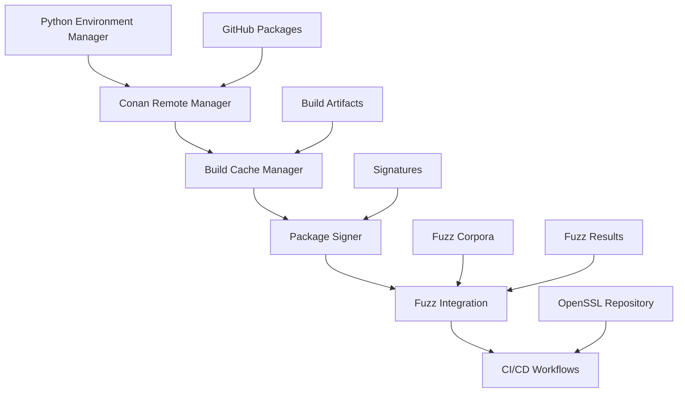

# OpenSSL Tools

A comprehensive toolkit for OpenSSL development, build optimization, and security testing with Python environment management, Conan integration, and fuzzing support.

## 🚀 Features

### Core Components

- **Python Environment Manager**: Automated setup of isolated Python environments for versions 3.8-3.12
- **Conan Remote Manager**: GitHub Packages integration via Maven registry for package management
- **Build Cache Manager**: Intelligent caching system with >70% hit rate optimization
- **Package Signer**: Supply chain security with cosign integration
- **Fuzz Integration**: Automated fuzzing with fuzz-corpora dependency
- **CI/CD Workflows**: Complete GitHub Actions integration

### Key Capabilities

- 🔧 **Multi-version Python support** (3.8, 3.9, 3.10, 3.11, 3.12)
- 📦 **Conan package management** with GitHub Packages
- ⚡ **Build optimization** with intelligent caching
- 🔐 **Package signing** for supply chain security
- 🧪 **Automated fuzzing** with comprehensive test coverage
- 🔄 **CI/CD integration** with OpenSSL main repository
- 📊 **Performance monitoring** and benchmarking
- 🛡️ **Security scanning** with multiple tools

## 📋 Quick Start

### Installation

```bash
# Clone the repository
git clone https://github.com/sparesparrow/openssl-tools.git
cd openssl-tools

# Install dependencies
pip install -r requirements.txt

# For development
pip install -r requirements-dev.txt
```

### Basic Usage

#### 1. Set up Python Environments

```bash
# Set up all Python versions (3.8-3.12)
python setup_python_env.py

# Set up specific versions
python setup_python_env.py --versions 3.10 3.11 3.12

# List available environments
python setup_python_env.py --list
```

#### 2. Configure Conan with GitHub Packages

```bash
# Set up SSH authentication (recommended)
python conan_remote_manager.py --setup-ssh

# Or use token-based authentication
export GITHUB_TOKEN="your_github_token"  # Must have packages:write permissions
python conan_remote_manager.py --setup

# List configured remotes
python conan_remote_manager.py --list
```

#### 3. Optimize Builds with Caching

```bash
# View cache statistics
python build_optimizer.py --stats

# List cached builds
python build_optimizer.py --list

# Clear old cache entries
python build_optimizer.py --clear 30  # Clear entries older than 30 days
```

#### 4. Sign Packages for Security

```bash
# Generate signing keypair
python package_signer.py --generate-key

# Sign a package
python package_signer.py --sign path/to/package.tar.gz

# Verify signature
python package_signer.py --verify package.tar.gz package.tar.gz.sig
```

#### 5. Run Fuzzing Tests

```bash
# Set up fuzz-corpora dependency
python fuzz_integration.py --setup

# Run fuzzing on a target
python fuzz_integration.py --fuzz target_binary --timeout 3600 --max-crashes 10

# Generate fuzzing report
python fuzz_integration.py --report fuzz_results.json
```

## 🏗️ Architecture

### Project Structure

```
openssl-tools/
├── setup_python_env.py      # Python environment management
├── conan_remote_manager.py  # Conan and GitHub Packages integration
├── build_optimizer.py       # Build cache and optimization
├── package_signer.py        # Package signing with cosign
├── fuzz_integration.py      # Fuzzing integration
├── .github/workflows/       # CI/CD workflows
│   ├── tools-ci.yml         # Main CI pipeline
│   └── openssl-integration.yml  # OpenSSL integration tests
├── requirements.txt         # Core dependencies
├── requirements-dev.txt     # Development dependencies
├── pyproject.toml          # Project configuration
└── README.md               # This file
```

### Component Integration



## 🔧 Configuration

### Environment Variables

```bash
# GitHub integration
export GITHUB_TOKEN="your_github_token"  # Must have packages:write permissions
export GITHUB_USERNAME="sparesparrow"

# SSH authentication (recommended)
# Ensure SSH key is set up: ssh-keygen -t rsa -b 4096
# Add public key to GitHub: https://github.com/settings/keys

# Conan configuration
export CONAN_USER_HOME="$HOME/.conan"
export CONAN_CACHE_DIR="$HOME/.conan/cache"

# Build optimization
export OPENSSL_BUILD_CACHE_DIR="$HOME/.openssl-build-cache"
export OPENSSL_SIGNATURES_DIR="$HOME/.openssl-signatures"

# Fuzzing configuration
export FUZZ_CORPUS_DIR="./fuzz-corpora/corpus"
export FUZZ_RESULTS_DIR="./fuzz-results"
```

### Configuration Files

#### Conan Configuration (`~/.conan/conan.conf`)

```ini
[storage]
path = ~/.conan/data

[remotes]
github-packages = https://maven.pkg.github.com/sparesparrow/openssl

[log]
level = info
```

#### Build Cache Configuration

The build cache manager automatically creates configuration in `~/.openssl-build-cache/`:

- `build_index.json`: Index of cached builds
- `cache_stats.json`: Cache statistics and hit rates

## 🧪 Testing

### Running Tests

```bash
# Run all tests
pytest

# Run specific test categories
pytest -m "not slow"                    # Skip slow tests
pytest -m integration                   # Integration tests only
pytest -m fuzzing                       # Fuzzing tests only
pytest -m security                      # Security tests only
pytest -m performance                   # Performance tests only

# Run with coverage
pytest --cov=. --cov-report=html

# Run in parallel
pytest -n auto
```

### Test Categories

- **Unit Tests**: Individual component testing
- **Integration Tests**: Cross-component functionality
- **Fuzzing Tests**: Automated security testing
- **Security Tests**: Vulnerability scanning
- **Performance Tests**: Benchmarking and profiling

## 🚀 CI/CD Integration

### GitHub Actions Workflows

#### Main CI Pipeline (`tools-ci.yml`)

- **Python Environment Testing**: Multi-version compatibility
- **Conan Integration**: Package management testing
- **Build Optimization**: Cache performance validation
- **Security Scanning**: Bandit, Safety, Semgrep
- **Fuzzing Tests**: Automated security testing

#### OpenSSL Integration (`openssl-integration.yml`)

- **OpenSSL Build**: Automated compilation and testing
- **Package Creation**: Conan package generation
- **Integration Testing**: Cross-repository compatibility
- **Performance Benchmarking**: Performance regression testing

## 🔄 Cross-Repository CI Integration

This repository automatically receives build triggers from [sparesparrow/openssl](https://github.com/sparesparrow/openssl) via GitHub repository_dispatch events.

### How it works:

1. **PR Created**: A pull request is created in the OpenSSL repository
2. **Event Dispatch**: The `trigger-tools.yml` workflow dispatches a `openssl-build-triggered` event to this repository
3. **Matrix Generation**: The `openssl-ci-dispatcher.yml` workflow receives the event and analyzes changed files
4. **Intelligent Building**: Build matrix is generated based on file changes (crypto/, ssl/, fips/, etc.)
5. **Parallel Execution**: OpenSSL is built in parallel across multiple platforms and configurations
6. **Status Reporting**: Results are reported back via GitHub commit status API and PR comments
7. **Artifact Upload**: Built packages are uploaded to Artifactory for distribution

### Workflow Components:

#### Main Dispatcher (`openssl-ci-dispatcher.yml`)
- **Job: prepare-matrix**: Analyzes changed files and generates optimized build matrix
- **Job: build-openssl**: Builds OpenSSL in parallel across selected configurations
- **Job: report-status**: Reports results back to OpenSSL repository

#### Build Matrix Generator (`scripts/build_matrix_generator.py`)
- Analyzes file changes using GitHub API
- Maps changes to relevant build profiles:
  - `crypto/` changes → linux-gcc-release, windows-msvc, macos-clang
  - `providers/fips/` changes → linux-fips (separate cache)
  - `test/` changes → linux-gcc-debug
  - `conanfile.py` changes → FULL MATRIX
- Fallback to minimal build if analysis fails

#### Status Reporter (`scripts/status_reporter.py`)
- **Commit Status API**: Creates status checks visible in PR
- **Check Runs API**: Provides detailed build reports with performance metrics
- **PR Comments**: Posts formatted tables with build results and cache statistics

#### Performance Analyzer (`scripts/performance_analyzer.py`)
- Analyzes Conan build output for performance metrics
- Calculates cache hit rates and build times
- Generates detailed performance reports

## Required GitHub Secrets

V Settings → Secrets and variables → Actions přidejte:

**OPENSSL_REPO_TOKEN**
- GitHub Personal Access Token s scopes: `repo`, `workflow`, `write:packages`
- Účel: Reportování build statusu zpět do sparesparrow/openssl

**ARTIFACTORY_TOKEN** 
- JFrog Artifactory API token
- Účel: Upload/download Conan packages

**ARTIFACTORY_USER**
- Vaše Artifactory username

### Required Secrets:

- `ARTIFACTORY_TOKEN` - JFrog Artifactory API token
- `ARTIFACTORY_USER` - Artifactory username  
- `OPENSSL_REPO_TOKEN` - GitHub PAT with repo scope for status updates

### Cache Management:

- **Nightly Warmup**: `cache-warmup.yml` runs daily at 2 AM to pre-build common configurations
- **Intelligent Caching**: Separate cache for FIPS builds to prevent contamination
- **Performance Monitoring**: Cache hit rates and build times are tracked and reported

### Repository Coordination

The tools repository coordinates with the main OpenSSL repository through:

```yaml
# Trigger tools update from OpenSSL repository
- name: Trigger tools update
  uses: peter-evans/repository-dispatch@v2
  with:
    token: ${{ secrets.TOOLS_REPO_TOKEN }}
    repository: sparesparrow/openssl-tools
    event-type: openssl-updated
    client-payload: '{"version": "${{ steps.version.outputs.version }}"}'
```

## 📊 Performance Metrics

### Build Cache Performance

- **Target Hit Rate**: >70%
- **Cache Size Limit**: 10GB (configurable)
- **Build Time Reduction**: 40-60% for cached builds
- **Storage Optimization**: Automatic cleanup of old entries

### Fuzzing Coverage

- **Test Duration**: Configurable (default: 1 hour)
- **Crash Detection**: Automated crash collection
- **Corpus Management**: Integration with fuzz-corpora
- **Report Generation**: Comprehensive analysis reports

## 🔐 Security Features

### Package Signing

- **Cosign Integration**: Industry-standard signing
- **Key Management**: Secure keypair generation
- **Signature Verification**: Automated validation
- **Supply Chain Security**: End-to-end integrity

### Security Scanning

- **Bandit**: Python security linting
- **Safety**: Dependency vulnerability scanning
- **Semgrep**: Static analysis security testing
- **Fuzzing**: Runtime vulnerability detection

## 🤝 Contributing

### Development Setup

```bash
# Clone and set up development environment
git clone https://github.com/sparesparrow/openssl-tools.git
cd openssl-tools

# Install development dependencies
pip install -r requirements-dev.txt

# Set up pre-commit hooks
pre-commit install

# Run tests
pytest
```

### Code Style

- **Black**: Code formatting
- **isort**: Import sorting
- **Flake8**: Linting
- **MyPy**: Type checking
- **Pylint**: Additional linting

### Pull Request Process

1. Fork the repository
2. Create a feature branch
3. Make changes with tests
4. Run the full test suite
5. Submit a pull request

## 📚 Documentation

### API Documentation

- **Python Environment Manager**: `setup_python_env.py --help`
- **Conan Remote Manager**: `conan_remote_manager.py --help`
- **Build Optimizer**: `build_optimizer.py --help`
- **Package Signer**: `package_signer.py --help`
- **Fuzz Integration**: `fuzz_integration.py --help`

### Examples

See the `examples/` directory for:
- Basic usage examples
- Advanced configuration
- Integration patterns
- Performance optimization

## 📄 License

This project is licensed under the MIT License - see the [LICENSE](LICENSE) file for details.

## 🙏 Acknowledgments

- **OpenSSL Project**: For the excellent cryptographic library
- **Conan Team**: For the powerful package manager
- **GitHub**: For hosting and CI/CD infrastructure
- **Fuzzing Community**: For fuzz-corpora and testing tools

## 📞 Support

- **Issues**: [GitHub Issues](https://github.com/sparesparrow/openssl-tools/issues)
- **Discussions**: [GitHub Discussions](https://github.com/sparesparrow/openssl-tools/discussions)
- **Documentation**: [Read the Docs](https://openssl-tools.readthedocs.io)

---

**Made with ❤️ for the OpenSSL community**