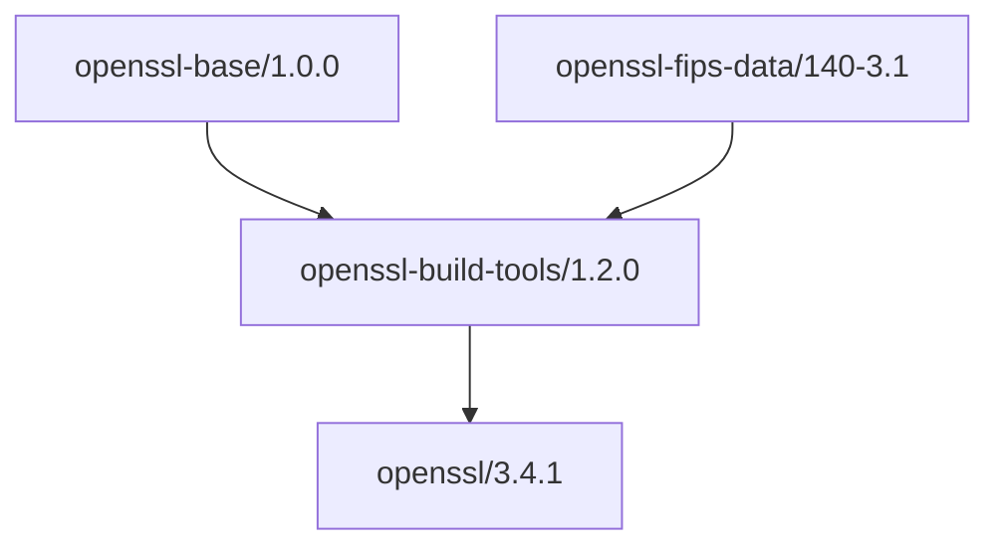

# OpenSSL Build Tools

Build orchestration for OpenSSL with foundation dependencies.

## Usage

### Quick Start

```bash
# Configure Cloudsmith remote
conan remote add sparesparrow-conan \
  https://conan.cloudsmith.io/sparesparrow-conan/openssl-conan/ \
  --force

# Consume the tools
conan install --requires=openssl-build-tools/1.2.0 -r=sparesparrow-conan
```

### Authentication (for publishing)

```bash
# Login to Cloudsmith remote
conan remote login sparesparrow-conan <username> --password <api-key>

# Or use environment variable
export CLOUDSMITH_API_KEY=<your-api-key>
conan remote login sparesparrow-conan <username> --password "$CLOUDSMITH_API_KEY"
```

## CI/CD Configuration

### Required Secrets

The following secrets must be configured in your repository settings (`Settings > Secrets and variables > Actions`):

| Secret Name | Description | How to Obtain |
|-------------|-------------|---------------|
| `CLOUDSMITH_API_KEY` | API key for Cloudsmith authentication | Generate at https://cloudsmith.io/user/settings/api/ |

### Optional Secrets for Artifact Signing

| Secret Name | Description |
|-------------|-------------|
| `COSIGN_PRIVATE_KEY` | Private key for Cosign artifact signing |
| `COSIGN_PASSWORD` | Password for Cosign private key |

### CI Features

The build workflow includes:

- ✅ **Dependency Caching**: Conan packages and pip dependencies are cached for faster builds
- ✅ **Lock Management**: Automatic cleanup of stale Conan locks
- ✅ **Dependency Tracking**: Generates and uploads dependency graphs as artifacts
- ✅ **SBOM Generation**: Creates Software Bill of Materials for compliance
- ✅ **Artifact Signing**: Uses Cosign for cryptographic attestation (on main/master branch)
- ✅ **Branch Protection**: Cloudsmith uploads gated to main/master branches only

### Conan Configuration

The workflow automatically installs Conan profiles from `conan-profiles/` directory if present. To use custom profiles locally:

```bash
# Install profiles from this repository
conan config install conan-profiles --type=dir

# Or from a remote config repository
conan config install https://github.com/your-org/conan-config.git
```

## Dependencies

- openssl-base/1.0.0
- openssl-fips-data/140-3.1

## Architecture



## Development

### Local Package Creation

```bash
# Create package locally
conan create . --build=missing

# Generate dependency graph
conan graph info . --format=json > dependency-graph.json

# Create lock file for reproducible builds
conan lock create . --lockfile=conan.lock
```

### Troubleshooting

#### Stale Lock Issues

If you encounter "Package already locked" errors:

```bash
# Clean all locks
conan cache clean --locks

# Or clean specific package locks
conan cache clean "openssl-build-tools/*" --locks
```

#### Cache Issues

```bash
# Clean entire cache (use with caution)
conan cache clean "*"

# Remove specific package
conan remove "openssl-build-tools/*" --confirm
```