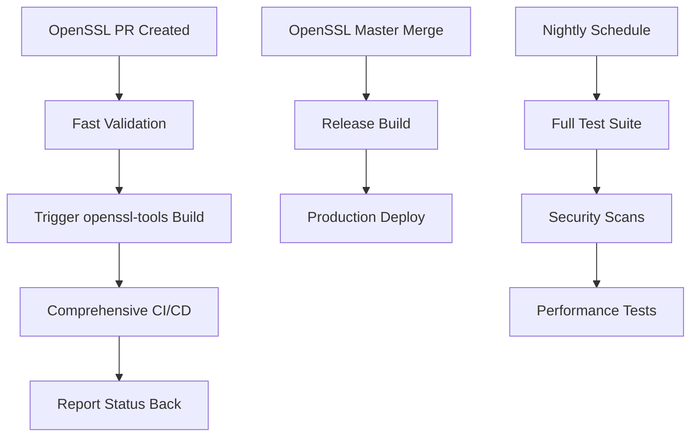

# OpenSSL Tools

Build tools, automation scripts, and infrastructure components for the modernized OpenSSL CI/CD pipeline.

**Version 2.2.3** - Includes bundled Python 3.12.3 for cross-platform compatibility.

## Quick Start

### Installation via Conan

```bash
# Install with Conan (recommended)
conan install openssl-tools/2.2.3@sparesparrow/stable --build=missing

# Or build from source
conan create . --version=2.2.3 --build=missing
```

### Legacy Installation

```bash
pip install -e .
```

### Basic Usage

```bash
# Set up development environment
openssl-env --dev

# Run tests
openssl-test

# Build OpenSSL
openssl-build

# Validate setup
openssl-validate
```

### Bundled Python 3.12.3

This package includes a bundled Python 3.12.3 interpreter for cross-platform compatibility:

**Features:**
- ✅ Cross-platform Python 3.12.3 runtime
- ✅ Automatic environment setup
- ✅ Conan cache integration
- ✅ Wrapper scripts for Unix/Windows

**Cross-Platform Usage:**

```bash
# Unix/Linux/macOS
/path/to/openssl-tools/bin/openssl-tools --version

# Windows
C:\\path\\to\\openssl-tools\\bin\\openssl-tools.bat --version
```

**Bootstrap Setup:**
```bash
# Run bootstrap script to validate and set up environment
python bootstrap-init.py

# This will:
# - Validate Conan installation
# - Check bundled Python availability
# - Test Python environment
# - Create activation scripts
```

## Architecture

This repository implements a **two-repository CI/CD architecture**:

- **[OpenSSL Repository](https://github.com/sparesparrow/openssl)**: Source code and fast validation
- **[OpenSSL-Tools Repository](https://github.com/sparesparrow/openssl-tools)**: Build infrastructure and comprehensive CI/CD

## Configuration

### Cross-Repository Communication

Configure these secrets for full functionality:

```bash
# In OpenSSL repository
gh secret set DISPATCH_TOKEN --repo sparesparrow/openssl --body "$YOUR_GITHUB_TOKEN"

# In OpenSSL-Tools repository  
gh secret set OPENSSL_TOKEN --repo sparesparrow/openssl-tools --body "$YOUR_GITHUB_TOKEN"
```

**Required Token Scopes**: `repo`, `workflow`

## Workflow Integration



## Available Commands

- `openssl-env` - Environment setup (--minimal, --full, --dev)
- `openssl-build` - Build optimization and management
- `openssl-conan` - Conan package management
- `openssl-test` - Test execution and validation
- `openssl-security` - Security validation and scanning
- `openssl-monitor` - Status monitoring and reporting
- `openssl-workflow` - Workflow management and automation

## Documentation

- **[Getting Started](docs/README.md)** - Detailed setup guide
- **[Contributing](docs/CONTRIBUTING.md)** - How to contribute
- **[Technical Details](.cursor/docs/)** - Deep technical documentation
- **[AI Agent Rules](.cursor/rules/)** - Cursor AI configuration

## Separate Packages

These packages are being extracted to separate repositories:

- **[openssl-migration](https://github.com/sparesparrow/openssl-migration)** - Migration framework
- **[openssl-crypto](https://github.com/sparesparrow/openssl-crypto)** - Crypto library wrappers  
- **[openssl-ssl](https://github.com/sparesparrow/openssl-ssl)** - SSL/TLS utilities
- **[openssl-query](https://github.com/sparesparrow/openssl-query)** - Perl-based query tool

## License

MIT License - see [LICENSE](LICENSE) for details.