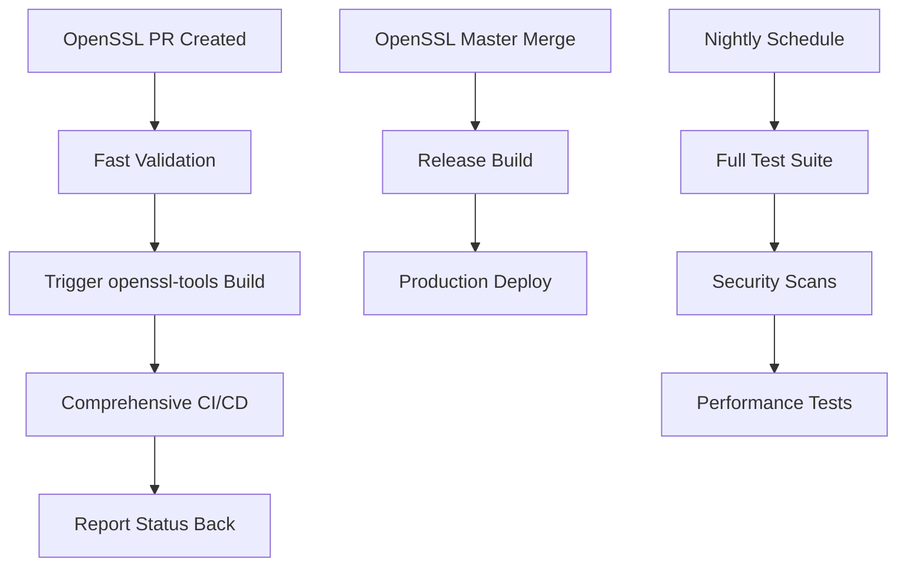

# OpenSSL Tools

Build tools, automation scripts, and infrastructure components for the modernized OpenSSL CI/CD pipeline.

## Quick Start

### Installation

```bash
# Clone the repository
git clone https://github.com/sparesparrow/openssl-tools.git
cd openssl-tools

# Run automated setup
./scripts/dev-setup.sh setup

# Edit configuration
cp .env.template .env
# Edit .env with your Artifactory credentials

# Test the setup
./scripts/dev-setup.sh test
```

### AI-Powered CI Repair

The agent-loop scripts provide automated CI/CD workflow monitoring and repair capabilities.

#### Quick Start

```bash
# Display help and usage information
bash agent-loop.sh --help
bash agent-loop-improved.sh --help

# Simple mode - rerun failed workflows (no API key required)
bash agent-loop.sh --once "Fix failed workflows" execution

# AI-powered mode - intelligent analysis and fixes (requires CURSOR_API_KEY)
export CURSOR_API_KEY="your-api-key"
bash agent-loop.sh "Fix all failed workflows" execution

# Dry-run mode - simulate actions without changes
bash agent-loop.sh --dry-run --once "Analyze issues" planning

# Enhanced security mode with configuration file
bash agent-loop-improved.sh --once "Comprehensive CI repair" execution
```

#### Configuration

The scripts can be configured via environment variables:

```bash
export REPO="sparesparrow/openssl-tools"    # Target repository
export PR_NUMBER="17"                        # PR number to monitor
export PR_BRANCH="pr-11-clean-documentation-agent"  # Branch name
export MAX_ITERATIONS="12"                   # Maximum loop iterations (default: 12)
export INTERVAL="60"                         # Seconds between iterations (default: 60)
export AGENT_TIMEOUT_SEC="60"                # Agent timeout in seconds (default: 60)
export LOG_LEVEL="info"                      # Logging level: debug|info|warn|error
export DRY_RUN="false"                       # Simulate without changes
export RUN_ONCE="true"                       # Single iteration mode
```

Or use a configuration file (`.agent-config.json`) for `agent-loop-improved.sh`:

```json
{
  "repo": "sparesparrow/openssl-tools",
  "pr_number": "17",
  "pr_branch": "pr-11-clean-documentation-agent",
  "max_iterations": 12,
  "interval": 60,
  "agent_timeout_sec": 60,
  "log_level": "info",
  "dry_run": false
}
```

#### Required GitHub Permissions

To use the agent-loop scripts, your GitHub token (via `gh` CLI) needs the following permissions:

- **`repo`**: Full control of private repositories
  - Required for: Reading workflow runs, triggering reruns, accessing PR status
- **`workflow`**: Update GitHub Action workflows  
  - Required for: Rerunning workflows, approving workflow runs
- **`read:org`**: Read org and team membership
  - Required for: Accessing organization-level workflow information

To configure your GitHub CLI:

```bash
# Login with appropriate scopes
gh auth login --scopes repo,workflow,read:org

# Verify authentication
gh auth status
```

#### Security Features

The `agent-loop-improved.sh` script includes enhanced security:

- **Secrets redaction**: Automatically masks API keys and tokens in logs
- **Secure API key storage**: Use `$HOME/.cursor/api-key` with mode 600
- **Input validation**: Validates all configuration parameters
- **Circuit breaker**: Prevents infinite retry loops
- **Dry-run mode**: Test changes before applying them

```bash
# Set up secure API key storage
mkdir -p ~/.cursor
echo "your-api-key" > ~/.cursor/api-key
chmod 600 ~/.cursor/api-key

# Run with secure configuration
bash agent-loop-improved.sh --once "Fix workflows" execution
```

#### Examples

```bash
# Example 1: Quick fix for failed workflows (single run)
bash agent-loop.sh --once "Rerun failed workflows" execution

# Example 2: Continuous monitoring with AI-powered fixes
export CURSOR_API_KEY="key_xxx"
bash agent-loop.sh "Monitor and fix all workflows" execution

# Example 3: Dry-run to see what would be done
bash agent-loop-improved.sh --dry-run --once "Analyze CI state" planning

# Example 4: Configure via environment and run
export PR_NUMBER="17"
export PR_BRANCH="feature-branch"
export MAX_ITERATIONS="5"
export INTERVAL="120"
bash agent-loop.sh "Targeted workflow repair" execution
```

### Python Package Usage

```bash
# Install the package
pip install -e .
```

### Basic Usage

```bash
# Set up development environment
openssl-env --dev

# Run tests
openssl-test

# Build OpenSSL
openssl-build

# Validate setup
openssl-validate
```

## Architecture

This repository implements a **two-repository CI/CD architecture**:

- **[OpenSSL Repository](https://github.com/sparesparrow/openssl)**: Source code and fast validation
- **[OpenSSL-Tools Repository](https://github.com/sparesparrow/openssl-tools)**: Build infrastructure and comprehensive CI/CD

## Configuration

### Cross-Repository Communication

Configure these secrets for full functionality:

```bash
# In OpenSSL repository
gh secret set DISPATCH_TOKEN --repo sparesparrow/openssl --body "$YOUR_GITHUB_TOKEN"

# In OpenSSL-Tools repository  
gh secret set OPENSSL_TOKEN --repo sparesparrow/openssl-tools --body "$YOUR_GITHUB_TOKEN"
```

**Required Token Scopes**: `repo`, `workflow`

## Workflow Integration



## Available Commands

- `openssl-env` - Environment setup (--minimal, --full, --dev)
- `openssl-build` - Build optimization and management
- `openssl-conan` - Conan package management
- `openssl-test` - Test execution and validation
- `openssl-security` - Security validation and scanning
- `openssl-monitor` - Status monitoring and reporting
- `openssl-workflow` - Workflow management and automation

## Documentation

- **[Getting Started](docs/README.md)** - Detailed setup guide
- **[Contributing](docs/CONTRIBUTING.md)** - How to contribute
- **[Technical Details](.cursor/docs/)** - Deep technical documentation
- **[AI Agent Rules](.cursor/rules/)** - Cursor AI configuration

## Separate Packages

These packages are being extracted to separate repositories:

- **[openssl-migration](https://github.com/sparesparrow/openssl-migration)** - Migration framework
- **[openssl-crypto](https://github.com/sparesparrow/openssl-crypto)** - Crypto library wrappers  
- **[openssl-ssl](https://github.com/sparesparrow/openssl-ssl)** - SSL/TLS utilities
- **[openssl-query](https://github.com/sparesparrow/openssl-query)** - Perl-based query tool

## License

MIT License - see [LICENSE](LICENSE) for details.