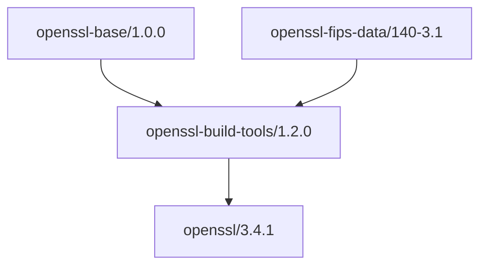

# OpenSSL Build Tools

Build orchestration for OpenSSL with foundation dependencies.

## Usage

```bash
# Configure Cloudsmith remote
conan remote add sparesparrow-conan \
  https://conan.cloudsmith.io/sparesparrow-conan/openssl-conan/ \
  --force

# Consume the tools
conan install --requires=openssl-build-tools/1.2.0 -r=sparesparrow-conan
```

## Dependencies

- openssl-base/1.0.0
- openssl-fips-data/140-3.1

## Architecture

