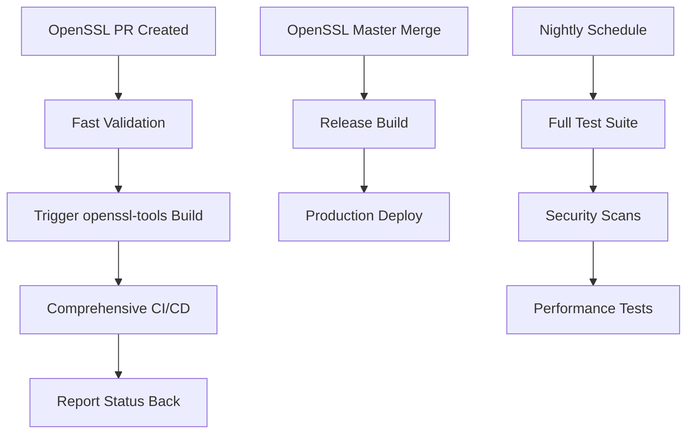

# OpenSSL Tools

Build tools, automation scripts, and infrastructure components for the modernized OpenSSL CI/CD pipeline.

## Quick Start

### Installation

```bash
pip install -e .
```

### Basic Usage

```bash
# Set up development environment
openssl-env --dev

# Run tests
openssl-test

# Build OpenSSL
openssl-build

# Validate setup
openssl-validate
```

## Architecture

This repository implements a **two-repository CI/CD architecture**:

- **[OpenSSL Repository](https://github.com/sparesparrow/openssl)**: Source code and fast validation
- **[OpenSSL-Tools Repository](https://github.com/sparesparrow/openssl-tools)**: Build infrastructure and comprehensive CI/CD

## Configuration

### Cross-Repository Communication

Configure these secrets for full functionality:

```bash
# In OpenSSL repository
gh secret set DISPATCH_TOKEN --repo sparesparrow/openssl --body "$YOUR_GITHUB_TOKEN"

# In OpenSSL-Tools repository  
gh secret set OPENSSL_TOKEN --repo sparesparrow/openssl-tools --body "$YOUR_GITHUB_TOKEN"
```

**Required Token Scopes**: `repo`, `workflow`

## Conan Extensions Integration

### Graph API Analyzer (`tools/graph_analyzer.py`)
Analyzes Conan dependency graphs for conflicts and outdated versions:

```bash
python tools/graph_analyzer.py path/to/conanfile.py --fail-on-conflict
```

**Features:**
- Dependency tree analysis
- Conflict detection
- Version compatibility checking
- Exit codes for CI integration

### Deploy Consumer (`tools/deploy_dev.py`)
Downloads and activates full_deploy bundles without requiring Conan:

```bash
python tools/deploy_dev.py --url <release_url> --dest .deps
```

**Features:**
- Downloads from GitHub Releases or Cloudsmith
- Extracts to configurable directory
- Sets up environment variables
- No Conan dependency required

## Development Workflow

### With Conan (Standard)
```bash
# Install dependencies
conan install ../openssl-conan-base --build=missing

# Run analysis
python tools/graph_analyzer.py ../openssl/conanfile.py
```

### With Deploy Bundle (No Conan)
```bash
# Download and activate bundle
python tools/deploy_dev.py --url https://github.com/.../releases/download/.../full-deploy-linux-x86_64-Release.zip

# Run analysis
python tools/graph_analyzer.py ../openssl/conanfile.py
```

## Integration

This repository integrates with:
- **openssl-conan-base**: For dependency packages and full_deploy bundles
- **openssl**: For core OpenSSL library testing
- **openssl-fips-policy**: For FIPS compliance validation
- **openssl-devenv**: For workspace orchestration

## Workflow Integration



## Available Commands

- `openssl-env` - Environment setup (--minimal, --full, --dev)
- `openssl-build` - Build optimization and management
- `openssl-conan` - Conan package management
- `openssl-test` - Test execution and validation
- `openssl-security` - Security validation and scanning
- `openssl-monitor` - Status monitoring and reporting
- `openssl-workflow` - Workflow management and automation

## Documentation

- **[Getting Started](docs/README.md)** - Detailed setup guide
- **[Contributing](docs/CONTRIBUTING.md)** - How to contribute
- **[Technical Details](.cursor/docs/)** - Deep technical documentation
- **[AI Agent Rules](.cursor/rules/)** - Cursor AI configuration

## Separate Packages

These packages are being extracted to separate repositories:

- **[openssl-migration](https://github.com/sparesparrow/openssl-migration)** - Migration framework
- **[openssl-crypto](https://github.com/sparesparrow/openssl-crypto)** - Crypto library wrappers  
- **[openssl-ssl](https://github.com/sparesparrow/openssl-ssl)** - SSL/TLS utilities
- **[openssl-query](https://github.com/sparesparrow/openssl-query)** - Perl-based query tool

## License

MIT License - see [LICENSE](LICENSE) for details.