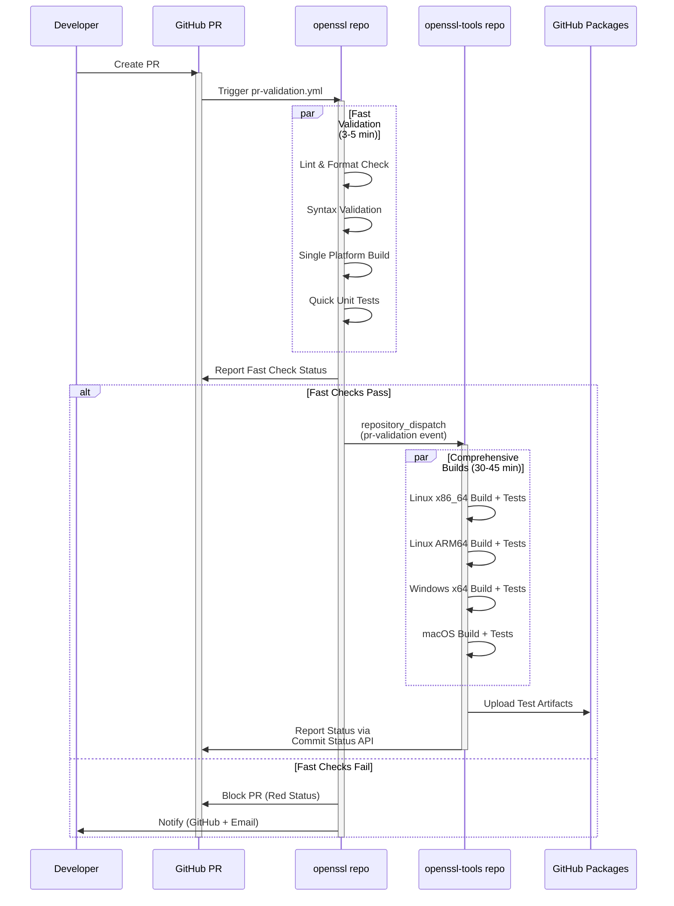
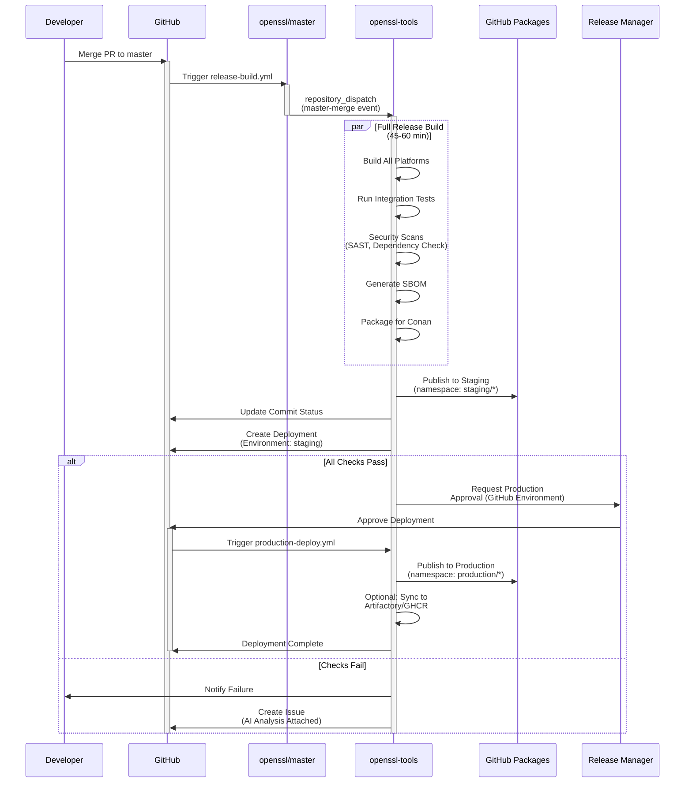
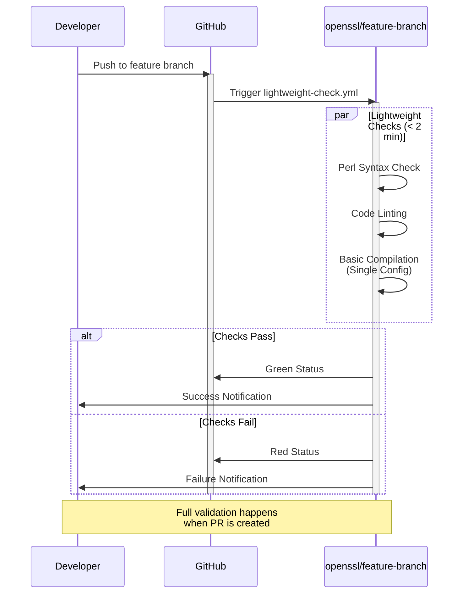
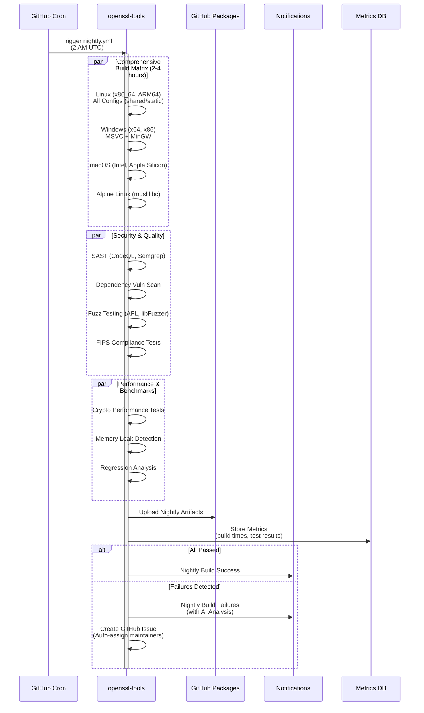

# OpenSSL Tools Repository

This repository contains build tools, automation scripts, and infrastructure components for the modernized OpenSSL CI/CD pipeline with Docker-based multi-platform builds and Cursor Agents coordination.

## 📋 Current Status

### ✅ Foundation Work Completed
- **PR #12**: Workflow fixes and CI/CD improvements - **MERGED** ✅
- **PR #13**: Python structure foundation with Zen of Python principles - **MERGED** ✅

### 🔄 Active Pull Requests (Ready for Review)

| PR # | Title | Size | Status | Merge Order |
|------|-------|------|--------|-------------|
| [14](https://github.com/sparesparrow/openssl-tools/pull/14) | CI/CD workflow templates and documentation | 21,008 lines | Ready | 3 of 5 |
| [15](https://github.com/sparesparrow/openssl-tools/pull/15) | OpenSSL migration framework and enhanced documentation | 5,149 lines | Ready | 4 of 5 |
| [16](https://github.com/sparesparrow/openssl-tools/pull/16) | Conan extensions and hooks for OpenSSL development | 5,371 lines | Ready | 5 of 5 |
| [17](https://github.com/sparesparrow/openssl-tools/pull/17) | AI agent documentation and automation scripts | 3,188 lines | Ready | 6 of 6 |

### 🎯 Reorganization Benefits
- **Manageable PR Sizes**: All PRs are under 10K lines (except templates which are inherently verbose)
- **Clear Dependencies**: Foundation work merged first, enabling green CI
- **Focused Changes**: Each PR has a single, clear purpose
- **Clean History**: Squashed commits for foundation work, clean branches for features

## 🔄 Two-Repository Architecture

This repository implements a **two-repository CI/CD architecture** for clean separation of concerns:

- **[OpenSSL Repository](https://github.com/sparesparrow/openssl)**: Source code and fast validation
- **[OpenSSL-Tools Repository](https://github.com/sparesparrow/openssl-tools)**: Build infrastructure and comprehensive CI/CD

### Cross-Repository Communication

For full functionality, configure the following secrets:

#### In OpenSSL Repository (`sparesparrow/openssl`):
```bash
gh secret set DISPATCH_TOKEN --repo sparesparrow/openssl --body "$YOUR_GITHUB_TOKEN"
```

#### In OpenSSL-Tools Repository (`sparesparrow/openssl-tools`):
```bash
gh secret set OPENSSL_TOKEN --repo sparesparrow/openssl-tools --body "$YOUR_GITHUB_TOKEN"
```

**Required Token Scopes**: `repo`, `workflow`

### Workflow Integration

1. **PR Created in OpenSSL** → Fast validation (3-5 min) in OpenSSL repo
2. **Fast Validation Passes** → Comprehensive build triggered in OpenSSL-Tools repo
3. **Build Completes** → Status reported back to OpenSSL PR

### Testing Status

- ✅ **DISPATCH_TOKEN configured** in OpenSSL repository
- ✅ **OPENSSL_TOKEN configured** in OpenSSL-Tools repository
- ✅ **Workflow definitions verified** for two-repository architecture
- ✅ **Lightweight branch check** working correctly
- ⏳ **Cross-repository dispatch** testing in progress
- ⏳ **Status reporting** verification pending

## 🚀 Quick Start

### Prerequisites

- Docker and Docker Compose
- Python 3.11+
- Git
- curl
- GitHub CLI (`gh`) - for workflow management
- Cursor CLI (`cursor-agent`) - for AI-powered CI repair (optional)

### Setup Development Environment

```bash
# Clone the repository
git clone https://github.com/sparesparrow/openssl-tools.git
cd openssl-tools

# Run automated setup
./scripts/dev-setup.sh setup

# Edit configuration
cp .env.template .env
# Edit .env with your Artifactory credentials

# Test the setup
./scripts/dev-setup.sh test
```

### AI-Powered CI Repair

```bash
# Simple mode (no API key required)
./agent-loop.sh

# AI-powered mode (requires CURSOR_API_KEY)
export CURSOR_API_KEY="your-api-key"
./agent-loop.sh "Fix all failed workflows" execution
```

### Python Package Usage

The repository now follows **Zen of Python** principles with a clean, organized package structure:

```bash
# Install the package
pip install -e .

# Use the main CLI
openssl-tools --help
openssl-tools workflow analyze --repo sparesparrow/openssl-tools
openssl-tools build optimize --cache-dir ~/.openssl-cache
openssl-tools conan setup-remote --token $GITHUB_TOKEN

# Use specialized CLI commands
openssl-security validate --config security.yml
openssl-test run --suite integration
openssl-monitor status --format json
openssl-sbom --help

# Backward compatibility (root-level wrappers)
python conan_remote_manager.py --help
python build_optimizer.py --help
```

### Package Structure

```
openssl_tools/
├── __init__.py                 # Main package
├── cli/                        # CLI entry points
├── security/                   # Security validation and SBOM
├── testing/                    # Test automation and integration
├── monitoring/                 # Build monitoring and reporting
├── automation/                 # CI/CD automation
│   ├── deployment/            # Deployment scripts
│   └── workflows/             # Workflow management
├── conan/                     # Conan package management
├── ai_agents/                 # AI agent integration
└── utils/                     # Shared utilities
```

**Benefits:**
- ✅ **Clear Organization**: Each domain has its own package
- ✅ **Type Safety**: Full type hints throughout
- ✅ **Documentation**: Google-style docstrings with examples
- ✅ **CLI Integration**: Specialized commands for each domain
- ✅ **Backward Compatibility**: Root-level wrappers maintain existing workflows

**📚 Complete Documentation:**
- [Agent-Loop Documentation (English)](docs/agent-loop-documentation-en.md)
- [Agent-Loop Documentation (Czech)](docs/agent-loop-documentation.md)
- [Cursor Agent Setup Guide](.cursor/README-cursor-agent-setup.md)

### Run Build Pipeline

```bash
# Build all platforms and upload to Artifactory
./scripts/docker-build-and-upload.sh

# Validate uploaded packages
./scripts/validate-artifactory-packages.sh
```

## 🏗️ Architecture

### Two-Repository Design

This repository follows a **two-repository architecture** for clean separation of concerns:

- **[OpenSSL Repository](https://github.com/sparesparrow/openssl)**: Source code and core functionality
- **[OpenSSL Tools Repository](https://github.com/sparesparrow/openssl-tools)**: Build infrastructure and tooling

**Benefits:**
- ✅ **Cleaner Development**: OpenSSL contributors focus on cryptography, not build systems
- ✅ **Independent Evolution**: Build infrastructure can evolve without affecting source code
- ✅ **Reduced Complexity**: Each repository has a single, clear purpose
- ✅ **Better Security**: Build infrastructure changes don't require source code review
- ✅ **Faster Iteration**: Tools can be updated independently of OpenSSL releases

📚 **Learn More**: [Repository Separation Documentation](docs/explanation/repo-separation.md)

### CI/CD Workflow Diagrams

The following diagrams illustrate the desired workflow behavior for the two-repository architecture:

#### 1. PR Created in OpenSSL Repository



#### 2. PR Merged to Master in OpenSSL Repository



#### 3. Commit Pushed to Non-Master Branch in OpenSSL Repository



#### 4. Nightly Build on Master Branch



### Repository Structure

```
openssl-tools/
├── .cursor/agents/           # Cursor Agent configurations
├── docker/                   # Docker build environments
│   ├── Dockerfile.ubuntu-builder
│   ├── Dockerfile.windows-builder
│   ├── Dockerfile.macos-builder
│   └── docker-compose.yml
├── scripts/                  # Automation scripts
│   ├── docker-build-and-upload.sh
│   ├── cursor-agents-coordinator.sh
│   ├── validate-artifactory-packages.sh
│   ├── generate_sbom.py
│   └── dev-setup.sh
├── profiles/conan/           # Conan build profiles
├── templates/github-actions/ # Reusable GitHub Actions
├── artifacts/               # Build artifacts (generated)
└── logs/                    # Agent logs (generated)
```

### Supported Platforms

- **Ubuntu 20.04** (GCC 11)
- **Ubuntu 22.04** (Clang 14)
- **Windows 2022** (MSVC 193)
- **macOS x86_64** (Apple Clang 14)
- **macOS ARM64** (Apple Clang 14)

## 🤖 Cursor Agents

### OpenSSL Tools Agent

Coordinates infrastructure, dependency management, and artifact publishing:

- **Dependency Management**: Maintains Conan packages and profiles
- **Infrastructure Orchestration**: Manages Docker build environments
- **Artifact Publishing**: Handles Artifactory uploads and validation
- **Cross-Repo Coordination**: Syncs with OpenSSL core repository

### Agent Configuration

```yaml
# .cursor/agents/openssl-tools-agent.yml
name: "OpenSSL Tools & Infrastructure Agent"
type: "infrastructure-agent"
capabilities:
  - dependency_management
  - infrastructure_automation
  - container_orchestration
  - artifact_publishing
```

## 🐳 Docker Build Pipeline

### Multi-Stage Builds

Each platform uses optimized multi-stage Docker builds:

1. **Base Stage**: Install build dependencies
2. **Builder Stage**: Configure and compile OpenSSL
3. **Runtime Stage**: Create minimal runtime image
4. **Artifacts Stage**: Extract build artifacts

### Build Commands

```bash
# Build specific platform
cd docker/
docker-compose build ubuntu-22-04-clang

# Build all platforms
docker-compose build

# Run specific platform build
docker-compose run ubuntu-22-04-clang
```

## 📦 Conan Integration

### Profiles

Pre-configured Conan profiles for each platform:

- `profiles/conan/ubuntu-20.04.profile`
- `profiles/conan/ubuntu-22.04.profile`
- `profiles/conan/windows-msvc2022.profile`
- `profiles/conan/macos-arm64.profile`
- `profiles/conan/macos-x86_64.profile`

### Package Management

```bash
# List available profiles
conan profile list

# Show specific profile
conan profile show ubuntu-22.04

# Create Conan package
conan create . --profile:build=default --profile:host=ubuntu-22.04
```

## 🔧 Scripts Reference

### `docker-build-and-upload.sh`

Main build and upload pipeline:

```bash
# Build and upload all platforms
./scripts/docker-build-and-upload.sh

# Environment variables
export ARTIFACTORY_URL="https://your-artifactory.com"
export ARTIFACTORY_TOKEN="your-token"
export ARTIFACTORY_REPO="openssl-releases"
```

### `cursor-agents-coordinator.sh`

Manage Cursor Agents:

```bash
# Start agents
./scripts/cursor-agents-coordinator.sh start

# Monitor agents
./scripts/cursor-agents-coordinator.sh monitor

# Stop agents
./scripts/cursor-agents-coordinator.sh stop

# Coordinate build task
./scripts/cursor-agents-coordinator.sh coordinate
```

### `validate-artifactory-packages.sh`

Validate uploaded packages:

```bash
# Validate specific version
./scripts/validate-artifactory-packages.sh v3.2.0

# Validate latest build
./scripts/validate-artifactory-packages.sh
```

## 🚀 GitHub Actions

### Reusable Actions

- `setup-openssl-build`: Cross-platform build environment setup
- `run-openssl-tests`: Test execution with flaky test handling

### Workflow Templates

- `artifact-build-pipeline.yml`: Complete build and upload pipeline
- `github-packages-sync.yml`: GitHub Packages synchronization
- `artifact-verification.yml`: Package validation workflow

## 🔍 Development

### Using DevContainer

```bash
# Open in VS Code with DevContainer
code .

# Or use GitHub Codespaces
# The repository includes .devcontainer configuration
```

### Local Development

```bash
# Setup development environment
./scripts/dev-setup.sh setup

# Test setup
./scripts/dev-setup.sh test

# Reset environment
./scripts/dev-setup.sh reset
```

### Environment Variables

Copy `.env.template` to `.env` and configure:

```bash
# Artifactory Configuration
ARTIFACTORY_URL=https://your-artifactory.com
ARTIFACTORY_TOKEN=your-token-here
ARTIFACTORY_REPO=openssl-releases

# Build Configuration
DEFAULT_BUILD_PLATFORMS=ubuntu-22.04-clang,windows-2022
ENABLE_CONAN_UPLOAD=true
```

## 📊 Monitoring and Logs

### Agent Logs

- Core Agent: `logs/core-agent.log`
- Tools Agent: `logs/tools-agent.log`

### Build Artifacts

- Platform artifacts: `artifacts/{platform}/`
- Conan packages: `artifacts/{platform}/conan/`
- Build metadata: `artifacts/{platform}/BUILD_INFO.json`
- SBOM: `artifacts/{platform}/SBOM.json`

## 🔒 Security

### SBOM Generation

Automated Software Bill of Materials generation for all builds:

- CycloneDX format
- Component inventory
- Dependency tracking
- Security metadata

### Artifact Signing

- SHA256 checksums for all artifacts
- Cryptographic verification
- Integrity validation

## 🤝 Contributing

1. Fork the repository
2. Create a feature branch
3. Make your changes
4. Test with `./scripts/dev-setup.sh test`
5. Submit a pull request

### Adding New Platforms

1. Create new Dockerfile in `docker/`
2. Add service to `docker-compose.yml`
3. Create Conan profile in `profiles/conan/`
4. Update build matrix in scripts

## 📚 Documentation

- [Cursor Agents Documentation](https://cursor.sh/docs/agents)
- [Docker Multi-Stage Builds](https://docs.docker.com/develop/dev-best-practices/dockerfile_best-practices/)
- [Conan Package Manager](https://docs.conan.io/2.0/)
- [OpenSSL Build Documentation](https://www.openssl.org/docs/)

## 🆘 Troubleshooting

### Common Issues

**Docker build fails:**
```bash
# Check Docker is running
docker info

# Clean Docker cache
docker system prune -f

# Rebuild without cache
docker-compose build --no-cache
```

**Conan profile issues:**
```bash
# Reset Conan profiles
rm -rf ~/.conan2/profiles
conan profile detect --force

# Install custom profiles
cp profiles/conan/*.profile ~/.conan2/profiles/
```

**Agent coordination fails:**
```bash
# Check agent status
./scripts/cursor-agents-coordinator.sh monitor

# Restart agents
./scripts/cursor-agents-coordinator.sh stop
./scripts/cursor-agents-coordinator.sh start
```

## 📄 License

This project is licensed under the Apache License 2.0 - see the [LICENSE](LICENSE) file for details.

## 🙏 Acknowledgments

- OpenSSL project for the cryptographic library
- Cursor team for the AI-powered development environment
- Conan team for the package manager
- Docker team for containerization platform# CI Test Fri Oct 10 10:06:24 PM CEST 2025
# CI/CD Repair Test - Fri Oct 10 11:52:25 PM CEST 2025
# CI Queue Test
# Test workflow execution
