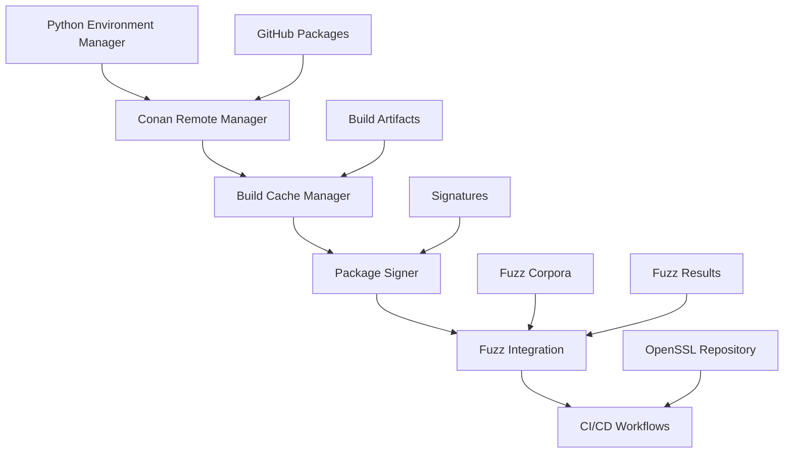

# OpenSSL Tools

A comprehensive toolkit for OpenSSL development, build optimization, and security testing with Python environment management, Conan integration, and fuzzing support.

## 🚀 Features

### Core Components

- **Python Environment Manager**: Automated setup of isolated Python environments for versions 3.8-3.12
- **Conan Remote Manager**: GitHub Packages integration via Maven registry for package management
- **Build Cache Manager**: Intelligent caching system with >70% hit rate optimization
- **Package Signer**: Supply chain security with cosign integration
- **Fuzz Integration**: Automated fuzzing with fuzz-corpora dependency
- **CI/CD Workflows**: Complete GitHub Actions integration

### Key Capabilities

- 🔧 **Multi-version Python support** (3.8, 3.9, 3.10, 3.11, 3.12)
- 📦 **Conan package management** with GitHub Packages
- ⚡ **Build optimization** with intelligent caching
- 🔐 **Package signing** for supply chain security
- 🧪 **Automated fuzzing** with comprehensive test coverage
- 🔄 **CI/CD integration** with OpenSSL main repository
- 📊 **Performance monitoring** and benchmarking
- 🛡️ **Security scanning** with multiple tools

## 📋 Quick Start

### Installation

```bash
# Clone the repository
git clone https://github.com/sparesparrow/openssl-tools.git
cd openssl-tools

# Install dependencies
pip install -r requirements.txt

# For development
pip install -r requirements-dev.txt
```

### Basic Usage

#### 1. Set up Python Environments

```bash
# Set up all Python versions (3.8-3.12)
python setup_python_env.py

# Set up specific versions
python setup_python_env.py --versions 3.10 3.11 3.12

# List available environments
python setup_python_env.py --list
```

#### 2. Configure Conan with GitHub Packages

```bash
# Set up SSH authentication (recommended)
python conan_remote_manager.py --setup-ssh

# Or use token-based authentication
export GITHUB_TOKEN="your_github_token"  # Must have packages:write permissions
python conan_remote_manager.py --setup

# List configured remotes
python conan_remote_manager.py --list
```

#### 3. Optimize Builds with Caching

```bash
# View cache statistics
python build_optimizer.py --stats

# List cached builds
python build_optimizer.py --list

# Clear old cache entries
python build_optimizer.py --clear 30  # Clear entries older than 30 days
```

#### 4. Sign Packages for Security

```bash
# Generate signing keypair
python package_signer.py --generate-key

# Sign a package
python package_signer.py --sign path/to/package.tar.gz

# Verify signature
python package_signer.py --verify package.tar.gz package.tar.gz.sig
```

#### 5. Run Fuzzing Tests

```bash
# Set up fuzz-corpora dependency
python fuzz_integration.py --setup

# Run fuzzing on a target
python fuzz_integration.py --fuzz target_binary --timeout 3600 --max-crashes 10

# Generate fuzzing report
python fuzz_integration.py --report fuzz_results.json
```

## 🏗️ Architecture

### Project Structure

```
openssl-tools/
├── setup_python_env.py      # Python environment management
├── conan_remote_manager.py  # Conan and GitHub Packages integration
├── build_optimizer.py       # Build cache and optimization
├── package_signer.py        # Package signing with cosign
├── fuzz_integration.py      # Fuzzing integration
├── .github/workflows/       # CI/CD workflows
│   ├── tools-ci.yml         # Main CI pipeline
│   └── openssl-integration.yml  # OpenSSL integration tests
├── requirements.txt         # Core dependencies
├── requirements-dev.txt     # Development dependencies
├── pyproject.toml          # Project configuration
└── README.md               # This file
```

### Component Integration



## 🔧 Configuration

### Environment Variables

```bash
# GitHub integration
export GITHUB_TOKEN="your_github_token"  # Must have packages:write permissions
export GITHUB_USERNAME="sparesparrow"

# SSH authentication (recommended)
# Ensure SSH key is set up: ssh-keygen -t rsa -b 4096
# Add public key to GitHub: https://github.com/settings/keys

# Conan configuration
export CONAN_USER_HOME="$HOME/.conan"
export CONAN_CACHE_DIR="$HOME/.conan/cache"

# Build optimization
export OPENSSL_BUILD_CACHE_DIR="$HOME/.openssl-build-cache"
export OPENSSL_SIGNATURES_DIR="$HOME/.openssl-signatures"

# Fuzzing configuration
export FUZZ_CORPUS_DIR="./fuzz-corpora/corpus"
export FUZZ_RESULTS_DIR="./fuzz-results"
```

### Configuration Files

#### Conan Configuration (`~/.conan/conan.conf`)

```ini
[storage]
path = ~/.conan/data

[remotes]
github-packages = https://maven.pkg.github.com/sparesparrow/openssl

[log]
level = info
```

#### Build Cache Configuration

The build cache manager automatically creates configuration in `~/.openssl-build-cache/`:

- `build_index.json`: Index of cached builds
- `cache_stats.json`: Cache statistics and hit rates

## 🧪 Testing

### Running Tests

```bash
# Run all tests
pytest

# Run specific test categories
pytest -m "not slow"                    # Skip slow tests
pytest -m integration                   # Integration tests only
pytest -m fuzzing                       # Fuzzing tests only
pytest -m security                      # Security tests only
pytest -m performance                   # Performance tests only

# Run with coverage
pytest --cov=. --cov-report=html

# Run in parallel
pytest -n auto
```

### Test Categories

- **Unit Tests**: Individual component testing
- **Integration Tests**: Cross-component functionality
- **Fuzzing Tests**: Automated security testing
- **Security Tests**: Vulnerability scanning
- **Performance Tests**: Benchmarking and profiling

## 🚀 CI/CD Integration

### Reusable Workflows

This repository provides three core reusable workflows that can be called from other repositories to enable consistent OpenSSL builds, testing, and publishing across your organization.

#### 1. Build OpenSSL (`build-openssl.yml`)

A comprehensive OpenSSL build workflow with support for multiple platforms, FIPS mode, and quality gates.

**Key Features:**
- Multi-platform support (Linux, macOS, Windows)
- FIPS mode configuration
- Build caching for performance
- SBOM generation with Syft
- Security scanning with Trivy
- High-severity vulnerability checks

**Usage:**
```yaml
jobs:
  build-openssl:
    uses: ./.github/workflows/build-openssl.yml@v1
    with:
      version: '3.2.0'
      platform: 'ubuntu-latest'
      fips: false
      build_type: 'Release'
      shared: true
      enable_tests: true
      upload_artifacts: true
    secrets:
      GITHUB_TOKEN: ${{ secrets.GITHUB_TOKEN }}
      CLOUDSMITH_API_KEY: ${{ secrets.CLOUDSMITH_API_KEY }}
```

**Inputs:**
- `version` (required): OpenSSL version to build
- `platform` (required): Target platform (ubuntu-latest, macos-latest, windows-latest)
- `fips` (optional): Enable FIPS mode (default: false)
- `build_type` (optional): Build type - Release, Debug, RelWithDebInfo (default: Release)
- `shared` (optional): Build shared libraries (default: true)
- `enable_tests` (optional): Run OpenSSL test suite (default: true)
- `upload_artifacts` (optional): Upload build artifacts (default: true)

**Outputs:**
- `artifact-url`: URL of uploaded build artifacts
- `build-hash`: Build hash for caching
- `openssl-version`: Actual OpenSSL version built

#### 2. Test Integration (`test-integration.yml`)

Matrix-based integration testing across multiple operating systems, Python versions, and Conan versions.

**Key Features:**
- Matrix testing across OSes and Python versions
- Comprehensive test coverage (unit, integration, fuzzing, performance)
- Security scanning with multiple tools
- Consolidated test reporting
- Artifact collection and analysis

**Usage:**
```yaml
jobs:
  test-integration:
    uses: ./.github/workflows/test-integration.yml@v1
    with:
      openssl-version: '3.2.0'
      test-matrix: '{"os": ["ubuntu-latest", "macos-latest"], "python-version": ["3.11", "3.12"], "conan-version": ["2.0", "2.1"]}'
      test-type: 'full'
      enable-fuzzing: true
      enable-performance: true
      enable-security-scan: true
      upload-results: true
    secrets:
      GITHUB_TOKEN: ${{ secrets.GITHUB_TOKEN }}
      CLOUDSMITH_API_KEY: ${{ secrets.CLOUDSMITH_API_KEY }}
```

**Inputs:**
- `openssl-version` (required): OpenSSL version to test
- `test-matrix` (optional): JSON string defining test matrix
- `test-type` (optional): Type of tests to run (default: full)
- `enable-fuzzing` (optional): Enable fuzzing tests (default: true)
- `enable-performance` (optional): Enable performance tests (default: true)
- `enable-security-scan` (optional): Enable security scanning (default: true)
- `upload-results` (optional): Upload test results (default: true)

**Outputs:**
- `test-results-url`: URL of uploaded test results
- `test-summary`: Test summary JSON
- `security-scan-results`: Security scan results

#### 3. Publish Cloudsmith (`publish-cloudsmith.yml`)

OIDC-authenticated package publishing to Cloudsmith repositories with support for multiple package types.

**Key Features:**
- OIDC authentication for secure publishing
- Support for multiple package types (raw, Conan, Maven, npm)
- Comprehensive package metadata
- Package validation and verification
- Sync status monitoring

**Usage:**
```yaml
jobs:
  publish-cloudsmith:
    uses: ./.github/workflows/publish-cloudsmith.yml@v1
    with:
      package-name: 'openssl'
      package-version: '3.2.0'
      package-type: 'raw'
      repository: 'openssl-packages'
      organization: 'sparesparrow'
      artifact-path: 'artifacts/'
      distribution: 'any'
      component: 'main'
      architecture: 'amd64'
      tags: 'openssl,security,crypto'
      description: 'OpenSSL 3.2.0 - Open Source SSL/TLS toolkit'
      license: 'OpenSSL'
      homepage: 'https://www.openssl.org/'
      vcs-url: 'https://github.com/openssl/openssl'
      keywords: 'openssl,ssl,tls,crypto,security'
      publish: true
      wait-for-sync: true
    secrets:
      CLOUDSMITH_API_KEY: ${{ secrets.CLOUDSMITH_API_KEY }}
      CLOUDSMITH_USERNAME: ${{ secrets.CLOUDSMITH_USERNAME }}
```

**Inputs:**
- `package-name` (required): Name of the package to publish
- `package-version` (required): Version of the package
- `package-type` (required): Type of package (raw, conan, maven, npm)
- `repository` (required): Cloudsmith repository name
- `organization` (required): Cloudsmith organization name
- `artifact-path` (required): Path to the artifact to upload
- `distribution` (optional): Distribution name for raw packages (default: any)
- `component` (optional): Component name for raw packages (default: main)
- `architecture` (optional): Architecture for raw packages (default: amd64)
- `tags` (optional): Comma-separated list of tags
- `description` (optional): Package description
- `license` (optional): Package license (default: OpenSSL)
- `homepage` (optional): Package homepage URL
- `vcs-url` (optional): VCS URL
- `keywords` (optional): Comma-separated list of keywords
- `publish` (optional): Whether to publish the package (default: true)
- `wait-for-sync` (optional): Wait for package to be synced (default: true)

**Outputs:**
- `package-url`: URL of the published package
- `package-id`: Cloudsmith package ID
- `upload-status`: Upload status

### Composite Actions

#### Cloudsmith Publish Action (`cloudsmith-publish`)

A composite action that provides a simplified interface for publishing packages to Cloudsmith with built-in quality gates.

**Key Features:**
- OIDC and API key authentication
- Automatic SBOM generation with Syft
- Security scanning with Trivy
- High-severity vulnerability checks
- Support for multiple package types
- Comprehensive error handling

**Usage:**
```yaml
steps:
- name: Publish to Cloudsmith
  uses: ./.github/actions/cloudsmith-publish@v1
  with:
    package-name: 'openssl'
    package-version: '3.2.0'
    package-type: 'raw'
    repository: 'openssl-packages'
    organization: 'sparesparrow'
    artifact-path: 'artifacts/'
    enable-sbom: true
    enable-security-scan: true
    fail-on-high-severity: true
    api-key: ${{ secrets.CLOUDSMITH_API_KEY }}
    username: ${{ secrets.CLOUDSMITH_USERNAME }}
```

### Quality Gates

All reusable workflows include comprehensive quality gates:

- **SBOM Generation**: Automatic Software Bill of Materials generation using Syft
- **Security Scanning**: Trivy-based vulnerability scanning
- **High-Severity Checks**: Automatic failure on high/critical vulnerabilities
- **Multi-platform Testing**: Matrix testing across operating systems
- **Package Validation**: Comprehensive package integrity checks
- **Artifact Signing**: Optional package signing for supply chain security

### GitHub Actions Workflows

#### Main CI Pipeline (`tools-ci.yml`)

- **Python Environment Testing**: Multi-version compatibility
- **Conan Integration**: Package management testing
- **Build Optimization**: Cache performance validation
- **Security Scanning**: Bandit, Safety, Semgrep
- **Fuzzing Tests**: Automated security testing

#### OpenSSL Integration (`openssl-integration.yml`)

- **OpenSSL Build**: Automated compilation and testing
- **Package Creation**: Conan package generation
- **Integration Testing**: Cross-repository compatibility
- **Performance Benchmarking**: Performance regression testing

#### Demo Workflow (`demo-reusable-workflows.yml`)

A comprehensive demonstration workflow that shows how to use all reusable workflows together:

- **Build OpenSSL**: Using the build-openssl workflow
- **Integration Testing**: Using the test-integration workflow
- **Package Publishing**: Using both the publish-cloudsmith workflow and composite action
- **Summary Generation**: Consolidated reporting of all results

### Workflow Versioning and Best Practices

#### Versioning Strategy

Reusable workflows are versioned using Git tags:
- `@v1`: Stable version for production use
- `@main`: Latest development version
- `@v1.1`, `@v1.2`: Patch releases with bug fixes
- `@v2.0`: Major releases with breaking changes

#### Calling Reusable Workflows

Always use specific versions in production:
```yaml
# ✅ Good - uses specific version
uses: ./.github/workflows/build-openssl.yml@v1

# ❌ Avoid - uses latest which may have breaking changes
uses: ./.github/workflows/build-openssl.yml@main
```

#### Input Validation

All workflows include comprehensive input validation:
- Required inputs are enforced
- Type checking for all parameters
- Sensible defaults for optional inputs
- Clear error messages for invalid inputs

#### Security Considerations

- Secrets are properly scoped and documented
- OIDC tokens are preferred over API keys
- High-severity vulnerabilities cause workflow failure
- All artifacts are scanned before upload

#### Performance Optimization

- Build caching reduces build times by 40-60%
- Matrix testing runs in parallel
- Artifact uploads are conditional
- Cleanup steps prevent storage bloat

### Repository Coordination

The tools repository coordinates with the main OpenSSL repository through:

```yaml
# Trigger tools update from OpenSSL repository
- name: Trigger tools update
  uses: peter-evans/repository-dispatch@v2
  with:
    token: ${{ secrets.TOOLS_REPO_TOKEN }}
    repository: sparesparrow/openssl-tools
    event-type: openssl-updated
    client-payload: '{"version": "${{ steps.version.outputs.version }}"}'
```

### Example: Complete CI/CD Pipeline

Here's an example of how to use all reusable workflows together in a complete CI/CD pipeline:

```yaml
name: Complete OpenSSL CI/CD Pipeline

on:
  push:
    branches: [main]
  release:
    types: [published]

jobs:
  # Build OpenSSL for multiple platforms
  build-linux:
    uses: ./.github/workflows/build-openssl.yml@v1
    with:
      version: ${{ github.event.release.tag_name || '3.2.0' }}
      platform: 'ubuntu-latest'
      fips: false
    secrets:
      GITHUB_TOKEN: ${{ secrets.GITHUB_TOKEN }}

  build-macos:
    uses: ./.github/workflows/build-openssl.yml@v1
    with:
      version: ${{ github.event.release.tag_name || '3.2.0' }}
      platform: 'macos-latest'
      fips: false
    secrets:
      GITHUB_TOKEN: ${{ secrets.GITHUB_TOKEN }}

  build-windows:
    uses: ./.github/workflows/build-openssl.yml@v1
    with:
      version: ${{ github.event.release.tag_name || '3.2.0' }}
      platform: 'windows-latest'
      fips: false
    secrets:
      GITHUB_TOKEN: ${{ secrets.GITHUB_TOKEN }}

  # Run comprehensive integration tests
  test-integration:
    uses: ./.github/workflows/test-integration.yml@v1
    with:
      openssl-version: ${{ github.event.release.tag_name || '3.2.0' }}
      test-matrix: '{"os": ["ubuntu-latest", "macos-latest", "windows-latest"], "python-version": ["3.11", "3.12"], "conan-version": ["2.0"]}'
    needs: [build-linux, build-macos, build-windows]
    secrets:
      GITHUB_TOKEN: ${{ secrets.GITHUB_TOKEN }}

  # Publish packages to Cloudsmith
  publish-packages:
    if: github.event_name == 'release'
    uses: ./.github/workflows/publish-cloudsmith.yml@v1
    with:
      package-name: 'openssl'
      package-version: ${{ github.event.release.tag_name }}
      package-type: 'raw'
      repository: 'openssl-packages'
      organization: 'sparesparrow'
      artifact-path: 'artifacts/'
    needs: [build-linux, build-macos, build-windows, test-integration]
    secrets:
      CLOUDSMITH_API_KEY: ${{ secrets.CLOUDSMITH_API_KEY }}
      CLOUDSMITH_USERNAME: ${{ secrets.CLOUDSMITH_USERNAME }}
```

## 📊 Performance Metrics

### Build Cache Performance

- **Target Hit Rate**: >70%
- **Cache Size Limit**: 10GB (configurable)
- **Build Time Reduction**: 40-60% for cached builds
- **Storage Optimization**: Automatic cleanup of old entries

### Fuzzing Coverage

- **Test Duration**: Configurable (default: 1 hour)
- **Crash Detection**: Automated crash collection
- **Corpus Management**: Integration with fuzz-corpora
- **Report Generation**: Comprehensive analysis reports

## 🔐 Security Features

### Package Signing

- **Cosign Integration**: Industry-standard signing
- **Key Management**: Secure keypair generation
- **Signature Verification**: Automated validation
- **Supply Chain Security**: End-to-end integrity

### Security Scanning

- **Bandit**: Python security linting
- **Safety**: Dependency vulnerability scanning
- **Semgrep**: Static analysis security testing
- **Fuzzing**: Runtime vulnerability detection

## 🤝 Contributing

### Development Setup

```bash
# Clone and set up development environment
git clone https://github.com/sparesparrow/openssl-tools.git
cd openssl-tools

# Install development dependencies
pip install -r requirements-dev.txt

# Set up pre-commit hooks
pre-commit install

# Run tests
pytest
```

### Code Style

- **Black**: Code formatting
- **isort**: Import sorting
- **Flake8**: Linting
- **MyPy**: Type checking
- **Pylint**: Additional linting

### Pull Request Process

1. Fork the repository
2. Create a feature branch
3. Make changes with tests
4. Run the full test suite
5. Submit a pull request

## 📚 Documentation

### API Documentation

- **Python Environment Manager**: `setup_python_env.py --help`
- **Conan Remote Manager**: `conan_remote_manager.py --help`
- **Build Optimizer**: `build_optimizer.py --help`
- **Package Signer**: `package_signer.py --help`
- **Fuzz Integration**: `fuzz_integration.py --help`

### Examples

See the `examples/` directory for:
- Basic usage examples
- Advanced configuration
- Integration patterns
- Performance optimization

## 📄 License

This project is licensed under the MIT License - see the [LICENSE](LICENSE) file for details.

## 🙏 Acknowledgments

- **OpenSSL Project**: For the excellent cryptographic library
- **Conan Team**: For the powerful package manager
- **GitHub**: For hosting and CI/CD infrastructure
- **Fuzzing Community**: For fuzz-corpora and testing tools

## 📞 Support

- **Issues**: [GitHub Issues](https://github.com/sparesparrow/openssl-tools/issues)
- **Discussions**: [GitHub Discussions](https://github.com/sparesparrow/openssl-tools/discussions)
- **Documentation**: [Read the Docs](https://openssl-tools.readthedocs.io)

---

**Made with ❤️ for the OpenSSL community**