# OpenSSL Tools - Tooling Layer Integration

## 🎯 Integration Overview

This diagram shows the comprehensive tooling layer integration post-merge, combining modules from multiple branches into a unified, production-ready system.

```mermaid
graph TB
    subgraph "🔧 Core Package Architecture"
        A[📦 conanfile.py<br/>Python-Require Package<br/>Version 1.2.0]
        B[📋 pyproject.toml<br/>Dependencies & Scripts<br/>Enhanced with new modules]
    end

    subgraph "🏗️ Foundation Modules"
        C[📊 version_manager.py<br/>Semantic Versioning<br/>FIPS Metadata Support]
        D[⚙️ profile_deployer.py<br/>Conan Profile Management<br/>Cross-Platform Support]
        E[🖥️ command_line/main.py<br/>CLI Interface<br/>Unified Commands]
    end

    subgraph "🔒 Security Modules"
        F[📋 sbom_generator.py<br/>CycloneDX SBOM<br/>FIPS Compliance]
        G[🛡️ Security Scanning<br/>Vulnerability Detection<br/>Compliance Validation]
    end

    subgraph "🤖 Automation Modules"
        H[🎯 conan_orchestrator.py<br/>CI/CD Orchestration<br/>Build Management]
        I[🔄 AI Agents<br/>Build/CI/Security Servers<br/>Workflow Automation]
        J[📦 Package Management<br/>Multi-Registry Support<br/>Artifact Distribution]
    end

    subgraph "🧪 Testing & Quality"
        K[📈 quality_manager.py<br/>Static Analysis<br/>Coverage Reports]
        L[🎲 fuzz_manager.py<br/>Fuzz Testing<br/>Corpora Management]
        M[📊 bn_rand_range.py<br/>Statistical Testing<br/>Data Generation]
    end

    subgraph "🔧 Core Infrastructure"
        N[🏢 artifactory_handler.py<br/>Artifact Management<br/>Cloudsmith Integration]
        O[📁 File Management<br/>Cross-Platform Support<br/>Environment Setup]
    end

    subgraph "🚀 CI/CD Workflows"
        P[⚡ conan-ci-enhanced.yml<br/>SBOM Generation<br/>Security Scanning<br/>Multi-Platform Builds]
        Q[📦 build-and-publish.yml<br/>Cloudsmith Publishing<br/>Artifact Management]
        R[🔥 cache-warmup.yml<br/>Dependency Caching<br/>Performance Optimization]
        S[🔄 Reusable Workflows<br/>Cross-Repository<br/>Integration Testing]
    end

    subgraph "📋 Integration Sources"
        T[🌿 consolidated-tooling-final<br/>Enhanced Workflows<br/>SBOM + Security]
        U[🎯 repo-slimming-tooling-only<br/>Pure Tooling Layer<br/>Additional Workflows]
        V[🔧 move-openssl-ci-to-tools<br/>CI Migration<br/>Consumer Validation]
    end

    subgraph "🎯 Consumer Integration"
        W[📱 Consumer Repositories<br/>Reusable Workflows<br/>Package Consumption]
        X[🔧 Development Environment<br/>CLI Tools<br/>Profile Management]
        Y[🏭 Production Deployment<br/>Artifact Distribution<br/>Security Compliance]
    end

    %% Core Package Relations
    A --> B
    A --> C
    A --> D
    A --> E
    A --> F
    A --> H
    A --> K
    A --> N

    %% Foundation Module Relations
    C --> D
    C --> E
    D --> E

    %% Security Integration
    F --> G
    G --> P

    %% Automation Integration
    H --> I
    H --> J
    I --> P
    J --> Q

    %% Testing Integration
    K --> L
    K --> M
    L --> P

    %% Core Infrastructure
    N --> O
    O --> P

    %% Workflow Integration
    P --> Q
    P --> R
    P --> S

    %% Source Integration
    T --> P
    U --> Q
    U --> R
    V --> S

    %% Consumer Integration
    S --> W
    E --> X
    Q --> Y
    F --> Y

    %% Styling
    classDef corePackage fill:#e1f5fe,stroke:#01579b,stroke-width:3px
    classDef foundation fill:#f3e5f5,stroke:#4a148c,stroke-width:2px
    classDef security fill:#ffebee,stroke:#b71c1c,stroke-width:2px
    classDef automation fill:#e8f5e8,stroke:#1b5e20,stroke-width:2px
    classDef testing fill:#fff3e0,stroke:#e65100,stroke-width:2px
    classDef infrastructure fill:#f1f8e9,stroke:#33691e,stroke-width:2px
    classDef workflows fill:#e3f2fd,stroke:#0d47a1,stroke-width:2px
    classDef sources fill:#fce4ec,stroke:#880e4f,stroke-width:2px
    classDef consumers fill:#f9fbe7,stroke:#827717,stroke-width:2px

    class A,B corePackage
    class C,D,E foundation
    class F,G security
    class H,I,J automation
    class K,L,M testing
    class N,O infrastructure
    class P,Q,R,S workflows
    class T,U,V sources
    class W,X,Y consumers
```

## 🎯 Key Integration Features

### **✅ Completed Integrations**

1. **Module Consolidation**: 8 high-value Python modules integrated from multiple branches
2. **Workflow Enhancement**: SBOM generation, security scanning, multi-platform builds
3. **Package Configuration**: Resolved conflicts, unified as `python-require` package
4. **Dependency Management**: Updated pyproject.toml with all required dependencies
5. **CI/CD Integration**: Enhanced workflows with retry logic, artifact management

### **🔧 Technical Achievements**

- **Foundation**: Version management, profile deployment, CLI interface
- **Security**: SBOM generation, vulnerability scanning, FIPS compliance
- **Automation**: CI/CD orchestration, AI agents, package management
- **Quality**: Static analysis, fuzz testing, statistical validation
- **Infrastructure**: Artifact management, cross-platform support

### **🚀 Production Readiness**

- **Verification**: All modules import and function correctly
- **Workflows**: Enhanced with security scanning and SBOM generation
- **Documentation**: Comprehensive integration summary and usage guides
- **Testing**: Quality gates and validation processes integrated

## 📊 Integration Statistics

- **Modules Integrated**: 8 core modules
- **Workflows Enhanced**: 3 major workflow files
- **Dependencies Added**: 4 new Python packages
- **Branches Merged**: 3 unmerged branches analyzed and integrated
- **Verification Status**: ✅ All tests passing

---

**Status**: ✅ **INTEGRATION COMPLETE**  
**Date**: October 21, 2025  
**Modules**: 8 integrated  
**Workflows**: Enhanced  
**Verification**: Complete